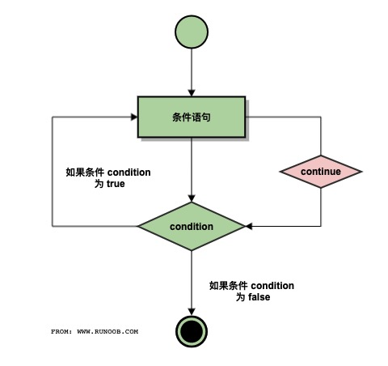

## Python基础语法

### 1. 编程方法

1. 交互式编程（在终端直接输入输出）
2. 脚本式编程（创建脚本程序，设置Python解释器PATH变量，使用命令`python xxx.py`运行程序）


### 2. 跨版本使用print函数

​		如果想在Python2.x中使用Python3.x的print函数，可以导入`__future__`包，该包禁用Python2.x的print语句，采用Python3.x的print函数。

```python
 >>> list =["a", "b", "c"]
 >>> print list    # python2.x 的 print 语句
 ['a', 'b', 'c']
 >>> from __future__ import print_function  # 导入 __future__ 包
 >>> print list     # Python2.x 的 print 语句被禁用，使用报错
   File "<stdin>", line 1
     print list
              ^
 SyntaxError: invalid syntax
 >>> print (list)   # 使用 Python3.x 的 print 函数
 ['a', 'b', 'c']
 >>>
```

​		Python3.x 与 Python2.x 的许多兼容性设计的功能可以通过 `__future__` 这个包来导入。


### 3. Python标识符

​		在 Python 中，所有标识符可以包括英文、数字以及下划线(_)，但不能以数字开头，区分大小写。

**Note：**

1️⃣ 以下划线开头的标识符是有特殊意义的。

1. 以单下划线开头 `_foo` 的代表不能直接访问的类属性，需通过类提供的接口进行访问，不能用 `from xxx import *` 而导入。
2. 以双下划线开头的 `__foo` 代表类的私有成员，以双下划线开头和结尾的 `__foo__` 代表 Python 里特殊方法专用的标识，如 `__init__()` 代表类的构造函数。

2️⃣ Python可以同一行显示多条语句，只需用`；`分开。


### 4. Python保留字符

保留字不能用作常数或变数，或任何其他标识符名称，Python中的关键字只包含小写字母。

| 关键字   | 关键字  | 关键字 |
| :------- | ------- | ------ |
| and      | exec    | not    |
| assert   | finally | or     |
| break    | for     | pass   |
| class    | from    | print  |
| continue | global  | raise  |
| def      | if      | return |
| del      | import  | try    |
| elif     | in      | while  |
| else     | is      | with   |
| except   | lambda  | yield  |


### 5. 行和缩进

​		Python 的代码块不使用大括号`{}`来控制类，Pythonyoga缩进写模块，缩进的空白数量是可变的，但是必须包含相同缩进方式相同空白数量的缩进。例如：

1. 不可以既有tab又有空格，否则会报如下的错

```python
IndentationError: unindent does not match any outer indentation level
```

1. 如果文件里的格式不对了，可能是tab和空格没对齐的问题，会出现如下报错

```python
IndentationError: unexpected indent
```

建议每个层次缩进时使用【单个制表符】或【两个空格】或【四个空格】，**不可混用！！**


### 6. 多行语句

Python语句中一般以新行作为语句的结束符。

但是我们可以使用斜杠（ \）将一行的语句分为多行显示，如下所示：

```python
 total = item_one + \
         item_two + \
         item_three
```

如果语句中包含[]、{}、()就不需要多行连接符，如下所示：

```python
 days = ['Monday', 'Tuesday', 'Wednesday',
         'Thursday', 'Friday']
```


### 7. Python引号

Python 可以使用引号 `'`、双引号 `"`、三引号`'''`或`"""` 来表示字符串，引号的开始与结束必须是相同类型的。

其中三引号可以由多行组成，编写多行文本的快捷语法，常用于文档字符串，在文件的特定地点，被当做注释。

```python
 word = 'word'
 sentence = "这是一个句子。"
 paragraph = """这是一个段落。
 包含了多个语句"""
```


### 8. Python注释

注释采用`#`开头，快捷键：`cmd+?`

```
 #!/usr/bin/python
 # -*- coding: UTF-8 -*-
 # 文件名：test.py
 
 # 第一个注释
 print ("Hello, Python!")  # 第二个注释
```

python 中多行注释使用三个单引号`'''` 或三个双引号 `"""`。

```python
 #!/usr/bin/python
 # -*- coding: UTF-8 -*-
 # 文件名：test.py
 
 
 '''
 这是多行注释，使用单引号。
 这是多行注释，使用单引号。
 这是多行注释，使用单引号。
 '''
 
 """
 这是多行注释，使用双引号。
 这是多行注释，使用双引号。
 这是多行注释，使用双引号。
 """
```


### 9. 等待用户输入

下面的程序执行后就会等待用户输入，按回车键后就会退出：

```python
 #!/usr/bin/python
 # -*- coding: UTF-8 -*-
 
 raw_input("按下 enter 键退出，其他任意键显示...\n")
```

其中，`\n`实现换行，一旦用户按下enter键则退出，其他键则显示。


### 10. 同一行显示多条语句

Python可以在同一行中使用多条语句，语句之间使用分号`;`分割，如下：

```python
 #!/usr/bin/python
 
 import sys; x = 'runoob'; sys.stdout.write(x + '\n')
```

执行结果：

```python
$ python test.py
runoob
```


### 11. print输出

print输出默认换行，如果要实现不换行需要在变量末尾加上逗号`,`。

```Python
#!/usr/bin/python
# -*- coding: UTF-8 -*-

x="a"
y="b"
# 换行输出
print x
print y

print '---------'
# 不换行输出
print x,
print y,

# 不换行输出
print x,y
```

执行结果：

```Python
a
b
---------
a b a b
```


### 12. 多个语句构成代码组

缩进相同的一组语句构成一个代码块，我们称之代码组。

像if、while、def和class这样的复合语句，首行以关键字开始，以冒号`:`结束，该行之后的一行或多行代码构成代码组。我们将首行及后面的代码组称为一个子句(clause)。

```
if expression : 
   suite 
elif expression :  
   suite  
else :  
   suite 
```


## Python变量类型

变量是存储在内存中的值，这就意味着在创建变量时会在内存中开辟一个空间。

基于变量的数据类型，解释器会分配指定内存，并决定什么数据可以被存储在内存中。

因此，变量可以指定不同的数据类型，这些变量可以存储整数，小数或字符。


### 1. 变量赋值

Python 中的变量赋值不需要类型声明。每个变量在使用前都必须赋值，变量赋值以后该变量才会被创建。

等号`=`用来给变量赋值。等号`=`运算符左边是一个变量名，等号`=`运算符右边是存储在变量中的值。

```
#!/usr/bin/python
# -*- coding: UTF-8 -*-
 
counter = 100 # 赋值整型变量
miles = 1000.0 # 浮点型
name = "John" # 字符串

print counter
print miles
print name
```

执行结果：

```Python
100
1000.0
John
```

### 2. 多变量赋值

Python允许同时为多个变量赋值：

```Python
a = b = c = 1
```

也可以为多个对象指定多个变量。例如：

```Python
a, b, c = 1, 2, "john"
```


### 3. 标准数据类型

Python 定义了一些标准类型，用于存储各种类型的数据。

Python有五个标准的数据类型：

- Numbers（数字）
- String（字符串）
- List（列表）
- Tuple（元组）
- Dictionary（字典）

#### 1) 数字

数字数据类型用于存储数值。

他们是**不可改变的**数据类型，**改变数字数据类型会分配一个新的对象**。

当你指定一个值时，Number 对象就会被创建：

```Python
var1 = 1
var2 = 10
```

也可以使用del语句删除一些对象的引用。

del语句的语法是：

```python
del var1[,var2[,var3[....,varN]]]
```

可以通过使用del语句删除单个或多个对象的引用。例如：

```
del var
del var_a, var_b
```

Python支持四种不同的数字类型：

- int（有符号整型）：是正或负整数，不带小数点；Python3 整型是没有限制大小的，可以当作 Long 类型使用；布尔(bool)是整型的子类型。
- float（浮点型）：由整数部分与小数部分组成，浮点型也可以使用科学计数法表示（2.5e2 = 2.5 x 102 = 250）
- complex（复数）：由实数部分和虚数部分构成，可以用a + bj，或者complex(a,b)表示，复数的实部a和虚部b都是浮点型。

| int    | float      | complex    |
| :----- | :--------- | :--------- |
| 10     | 0.0        | 3.14j      |
| 100    | 15.20      | 45.j       |
| -786   | -21.9      | 9.322e-36j |
| 080    | 32.3e+18   | .876j      |
| -0490  | -90.       | -.6545+0J  |
| -0x260 | -32.54e100 | 3e+26J     |
| 0x69   | 70.2E-12   | 4.53e-7j   |

一些数值类型的实例：

- 长整型也可以使用小写 l，但是还是建议您使用大写 L，避免与数字 1 混淆。Python使用 L 来显示长整型。
- Python 还支持复数，复数由实数部分和虚数部分构成，可以用 a + bj,或者 complex(a,b) 表示， 复数的实部 a 和虚部 b 都是浮点型。

*在 Python3.X 版本中 long 类型被移除，使用 int 替代。*

##### (1) 数学函数

| 函数           | 返回值 ( 描述 )                                              |
| :------------- | :----------------------------------------------------------- |
| abs(x)         | 返回数字的绝对值，如abs(-10) 返回 10                         |
| ceil(x)        | 返回数字的上入整数，如math.ceil(4.1) 返回 5                  |
| cmp(x, y)      | 如果 x < y 返回 -1, 如果 x == y 返回 0, 如果 x > y 返回 1。 **Python 3 已废弃，使用 (x>y)-(x<y) 替换**。 |
| exp(x)         | 返回e的x次幂(ex),如math.exp(1) 返回2.718281828459045         |
| fabs(x)        | 返回数字的绝对值，如math.fabs(-10) 返回10.0                  |
| floor(x)       | 返回数字的下舍整数，如math.floor(4.9)返回 4                  |
| log(x)         | 如math.log(math.e)返回1.0,math.log(100,10)返回2.0            |
| log10(x)       | 返回以10为基数的x的对数，如math.log10(100)返回 2.0           |
| max(x1,x2,...) | 返回给定参数的最大值，参数可以为序列。                       |
| min(x1,x2,...) | 返回给定参数的最小值，参数可以为序列。                       |
| modf(x)        | 返回x的整数部分与小数部分，两部分的数值符号与x相同，整数部分以浮点型表示。 |
| pow(x, y)      | x**y 运算后的值。                                            |
| [round(x [,n]) | 返回浮点数 x 的四舍五入值，如给出 n 值，则代表舍入到小数点后的位数。**其实准确的说是保留值将保留到离上一位更近的一端。** |
| sqrt(x)        | 返回数字x的平方根。                                          |

##### (2) 随机数函数

可以用于数学，游戏，安全等领域中，还经常被嵌入到算法中，用以提高算法效率，并提高程序的安全性。

| 函数                               | 描述                                                         |
| :--------------------------------- | :----------------------------------------------------------- |
| choice(seq)                        | 从序列的元素中随机挑选一个元素，比如random.choice(range(10))，从0到9中随机挑选一个整数。 |
| randrange ([start,\] stop [,step]) | 从指定范围内，按指定基数递增的集合中获取一个随机数，基数默认值为 1 |
| random()                           | 随机生成下一个实数，它在[0,1)范围内。                        |
| seed([x])                          | 改变随机数生成器的种子seed。如果你不了解其原理，你不必特别去设定seed，Python会帮你选择seed。 |
| shuffle(lst)                       | 将序列的所有元素随机排序                                     |
| uniform(x, y)                      | 随机生成下一个实数，它在[x,y]范围内。                        |

##### (3) 三角函数

| 函数        | 描述                                              |
| :---------- | :------------------------------------------------ |
| acos(x)     | 返回x的反余弦弧度值。                             |
| asin(x)     | 返回x的反正弦弧度值。                             |
| atan(x)     | 返回x的反正切弧度值。                             |
| atan2(y, x) | 返回给定的 X 及 Y 坐标值的反正切值。              |
| cos(x)      | 返回x的弧度的余弦值。                             |
| hypot(x, y) | 返回欧几里德范数 sqrt(x*x + y*y)。                |
| sin(x)      | 返回的x弧度的正弦值。                             |
| tan(x)      | 返回x弧度的正切值。                               |
| degrees(x)  | 将弧度转换为角度,如degrees(math.pi/2) ， 返回90.0 |
| radians(x)  | 将角度转换为弧度                                  |

##### (4) 数字常量

| 常量 | 描述                                  |
| :--- | :------------------------------------ |
| pi   | 数学常量 pi（圆周率，一般以π来表示）  |
| e    | 数学常量 e，e即自然常数（自然常数）。 |

#### 2) 字符串

字符串或串(String)是由**数字、字母、下划线**组成的一串字符。

一般记为 :

```python
s = "a1a2···an"   # n>=0
```

它是编程语言中表示文本的数据类型。

python的字串列表有2种取值顺序:

- 从左到右索引默认0开始的，最大范围是字符串长度少1
- 从右到左索引默认-1开始的，最大范围是字符串开头


如果想从字符串中获取一段子字符串，可以使用 **[头下标:尾下标]** 来截取相应的字符串，其中下标是从 0 开始算起，可以是正数或负数，下标可以为空表示取到头或尾。

**[头下标:尾下标]** 获取的子字符串包含头下标的字符，但**不包含尾下标的字符**。

比如:

```python
>>> s = 'abcdef'
>>> s[1:5]
'bcde'
```

加号（+）是字符串连接运算符，星号（*）是重复操作。

实例：

```python
# -*- coding: utf-8 -*-
"""
@Time ： 2022/5/4 16:47
@Auth ： Mona
@File ： python变量类型_实例.py
@IDE  ： PyCharm
"""
# 实例01--字符串
str = 'Hello world!'
print(str)
print(str[0])
print(str[2:5])
print(str[2:])
print(str * 2)
print(str + "TEST")
```

运行结果：

```python
Hello World!
H
llo
llo World!
Hello World!Hello World!
Hello World!TEST
```

##### (1) 转义字符

在需要在字符中使用特殊字符时，python 用反斜杠`\`转义字符。如下表：

| 转义字符    | 描述                                                         | 实例                                                         |
| :---------- | :----------------------------------------------------------- | :----------------------------------------------------------- |
| \(在行尾时) | 续行符                                                       | `>>>print("line1\ line2\ line3\ ")`<br />line1 line2 line3   |
| \\          | 反斜杠符号                                                   | `>>> print("\\") `<br />\                                    |
| \'          | 单引号                                                       | `>>> print('\'') `<br />'                                    |
| \"          | 双引号                                                       | `>>> print("\"") `<br />"                                    |
| \a          | 响铃                                                         | `>>> print("\a")`<br />执行后电脑有响声。                    |
| \b          | 退格(Backspace)                                              | `>>> print("Hello \b World!")`<br /> Hello World!            |
| \000        | 空                                                           | `>>> print("\000")` <br /><br />>>>                          |
| \n          | 换行                                                         | `>>> print("\n") ` <br /><br /><br />>>>                     |
| \v          | 纵向制表符                                                   | `>>> print("Hello \v World!")`<br /> Hello<br />        World!<br /> >>> |
| \t          | 横向制表符                                                   | `>>> print("Hello \t World!")` <br />Hello    World! <br />>>> |
| \r          | 回车，将 **\r** 后面的内容移到字符串开头，并逐一替换开头部分的字符，直至将 **\r** 后面的内容完全替换完成。 | `>>> print("Hello\rWorld!")`<br /> World! <br />`>>> print('google runoob taobao\r123456')`<br /> 123456 runoob taobao |
| \f          | 换页                                                         | `>>> print("Hello \f World!")`<br /> Hello <br />       World!<br /> >>> |
| \yyy        | 八进制数，y 代表 0~7 的字符，例如：\012 代表换行。           | `>>> print("\110\145\154\154\157\40\127\157\162\154\144\41")`<br /> Hello World! |
| \xyy        | 十六进制数，以 \x 开头，y 代表的字符，例如：\x0a 代表换行    | `>>>print("\x48\x65\x6c\x6c\x6f\x20\x57\x6f\x72\x6c\x64\x21")`<br /> Hello World! |
| \other      | 其它的字符以普通格式输出                                     |                                                              |

🌰：

```python
a = "Hello"
b = "Python"
 
print("a + b 输出结果：", a + b)
print("a * 2 输出结果：", a * 2)
print("a[1] 输出结果：", a[1])
print("a[1:4] 输出结果：", a[1:4])
 
if( "H" in a) :
    print("H 在变量 a 中")
else :
    print("H 不在变量 a 中")
 
if( "M" not in a) :
    print("M 不在变量 a 中")
else :
    print("M 在变量 a 中")
 
print (r'\n')
print (R'\n')
```

运行结果：

```python
a + b 输出结果： HelloPython
a * 2 输出结果： HelloHello
a[1] 输出结果： e
a[1:4] 输出结果： ell
H 在变量 a 中
M 不在变量 a 中
\n
\n
```

##### (2) 格式化

Python 支持格式化字符串的输出 。尽管这样可能会用到非常复杂的表达式，但最基本的用法是将一个值插入到一个有字符串格式符 %s 的字符串中。

🌰：

```python
print ("我叫 %s 今年 %d 岁!" % ('小明', 10))
```

运行结果：

```python
我叫 小明 今年 10 岁!
```

Python字符串格式化符号

| 符  号 | 描述                                 |
| :----- | :----------------------------------- |
| %c     | 格式化字符及其ASCII码                |
| %s     | 格式化字符串                         |
| %d     | 格式化整数                           |
| %u     | 格式化无符号整型                     |
| %o     | 格式化无符号八进制数                 |
| %x     | 格式化无符号十六进制数               |
| %X     | 格式化无符号十六进制数（大写）       |
| %f     | 格式化浮点数字，可指定小数点后的精度 |
| %e     | 用科学计数法格式化浮点数             |
| %E     | 作用同%e，用科学计数法格式化浮点数   |
| %g     | %f和%e的简写                         |
| %G     | %f 和 %E 的简写                      |
| %p     | 用十六进制数格式化变量的地址         |

**格式化操作符辅助指令**:

| 符号   | 功能                                                         |
| :----- | :----------------------------------------------------------- |
| *      | 定义宽度或者小数点精度                                       |
| -      | 用做左对齐                                                   |
| +      | 在正数前面显示加号( + )                                      |
| `<sp>` | 在正数前面显示空格                                           |
| #      | 在八进制数前面显示零('0')，在十六进制前面显示'0x'或者'0X'(取决于用的是'x'还是'X') |
| 0      | 显示的数字前面填充'0'而不是默认的空格                        |
| %      | '%%'输出一个单一的'%'                                        |
| (var)  | 映射变量(字典参数)                                           |
| m.n.   | m 是显示的最小总宽度,n 是小数点后的位数(如果可用的话)        |

新增了一种格式化字符串的函数 str.format()，它增强了字符串格式化的功能。

##### (3) 三引号

Python三引号允许一个字符串跨多行，字符串中可以包含换行符、制表符以及其他特殊字符。

🌰：

```python
para_str = """这是一个多行字符串的实例
多行字符串可以使用制表符
TAB ( \t )。
也可以使用换行符 [ \n ]。
"""
print (para_str)
```

运行结果：

```python
这是一个多行字符串的实例
多行字符串可以使用制表符
TAB (    )。
也可以使用换行符 [ 
 ]。
```

三引号让程序员从引号和特殊字符串的泥潭里面解脱出来，自始至终保持一小块字符串的格式是所谓的WYSIWYG（所见即所得）格式的。

一个典型的用例是，当你需要一块HTML或者SQL时，这时用字符串组合，特殊字符串转义将会非常的繁琐。

🌰：

```python
errHTML = '''
<HTML><HEAD><TITLE>
Friends CGI Demo</TITLE></HEAD>
<BODY><H3>ERROR</H3>
<B>%s</B><P>
<FORM><INPUT TYPE=button VALUE=Back
ONCLICK="window.history.back()"></FORM>
</BODY></HTML>
'''
cursor.execute('''
CREATE TABLE users (  
login VARCHAR(8), 
uid INTEGER,
prid INTEGER)
''')
```

##### (4) f-string

f-string是字面量格式化字符串，是新的格式化字符串的语法。

下面是习惯使用的方式：

```python
>>> name = 'Runoob'
>>> 'Hello %s' % name
'Hello Runoob'
```

**f-string** 格式化字符串以 **f** 开头，后面跟着字符串，字符串中的表达式用大括号 {} 包起来，它会**将变量或表达式计算后的值替换进去**。

🌰：

```python
>>> name = 'Runoob'
>>> f'Hello {name}'  # 替换变量
'Hello Runoob'
>>> f'{1+2}'         # 使用表达式
'3'

>>> w = {'name': 'Runoob', 'url': 'www.runoob.com'}
>>> f'{w["name"]}: {w["url"]}'
'Runoob: www.runoob.com'
```

可以使用 **=** 符号来拼接运算表达式与结果：

```python
>>> x = 1
>>> print(f'{x+1}')   # Python 3.6
2

>>> x = 1
>>> print(f'{x+1=}')   # Python 3.8
x+1=2
```

##### (5) 内建函数

| 序号 | 方法                                            | 描述                                                         |
| :--- | :---------------------------------------------- | ------------------------------------------------------------ |
| 1    | capitalize()                                    | 将字符串的第一个字符转换为大写                               |
| 2    | center(width, fillchar)                         | 返回一个指定的宽度 width 居中的字符串，fillchar 为填充的字符，默认为空格。 |
| 3    | count(str, beg= 0,end=len(string))              | 返回 str 在 string 里面出现的次数，如果 beg 或者 end 指定则返回指定范围内 str 出现的次数 |
| 4    | bytes.decode(encoding="utf-8", errors="strict") | Python3 中没有 decode 方法，但我们可以使用 bytes 对象的 decode() 方法来解码给定的 bytes 对象，这个 bytes 对象可以由 str.encode() 来编码返回。 |
| 5    | encode(encoding='UTF-8',errors='strict')        | 以 encoding 指定的编码格式编码字符串，如果出错默认报一个ValueError 的异常，除非 errors 指定的是'ignore'或者'replace' |
| 6    | endswith(suffix, beg=0, end=len(string))        | 检查字符串是否以 obj 结束，如果beg 或者 end 指定则检查指定的范围内是否以 obj 结束，如果是，返回 True,否则返回 False. |
| 7    | expandtabs(tabsize=8)                           | 把字符串 string 中的 tab 符号转为空格，tab 符号默认的空格数是 8 。 |
| 8    | find(str, beg=0, end=len(string))               | 检测 str 是否包含在字符串中，如果指定范围 beg 和 end ，则检查是否包含在指定范围内，如果包含返回开始的索引值，否则返回-1 |
| 9    | index(str, beg=0, end=len(string))              | 跟find()方法一样，只不过如果str不在字符串中会报一个异常。    |


#### 3) 列表

List（列表） 是 Python 中使用最频繁的数据类型。

列表可以完成大多数**集合类的数据结构**实现。它支持字符，数字，字符串甚至可以包含列表（即嵌套）。

列表用 **[ ]** 标识，是 python 最通用的复合数据类型。

列表中值的切割也可以用到变量 **[头下标:尾下标]** ，就可以截取相应的列表，从左到右索引默认 0 开始，从右到左索引默认 -1 开始，下标可以为空表示取到头或尾。

加号 **+** 是列表连接运算符，星号 ***** 是重复操作。

🌰：

```python
# 实例02--列表
list = ['runoob', 786, 2.23, 'mona', 70.2]
tinylist = [123, 'mona']
print(list)
print(list[0])
print(list[1:3])
print(list[2:])
print(tinylist *2)
print(list + tinylist)
```

运行结果：

```python
['runoob', 786, 2.23, 'john', 70.2]
runoob
[786, 2.23]
[2.23, 'john', 70.2]
[123, 'john', 123, 'john']
['runoob', 786, 2.23, 'john', 70.2, 123, 'john']
```

**Note：**可以使用 del 语句来删除列表的的元素

🌰：

```python
list = ['Google', 'Runoob', 1997, 2000]
 
print ("原始列表 : ", list)
del list[2]
print ("删除第三个元素 : ", list)
```

运行结果：

```python
原始列表 :  ['Google', 'Runoob', 1997, 2000]
删除第三个元素 :  ['Google', 'Runoob', 2000]
```

##### (1) 列表脚本操作符

列表对 + 和 * 的操作符与字符串相似。+ 号用于组合列表，* 号用于重复列表

| Python 表达式                         | 结果                         | 描述                 |
| :------------------------------------ | :--------------------------- | :------------------- |
| len([1, 2, 3])                        | 3                            | 长度                 |
| [1, 2, 3] + [4, 5, 6]                 | [1, 2, 3, 4, 5, 6]           | 组合                 |
| ['Hi!'] * 4                           | ['Hi!', 'Hi!', 'Hi!', 'Hi!'] | 重复                 |
| 3 in [1, 2, 3]                        | True                         | 元素是否存在于列表中 |
| for x in [1, 2, 3]: print(x, end=" ") | 1 2 3                        | 迭代                 |

##### (2) 嵌套列表

🌰：

```python
>>>a = ['a', 'b', 'c']
>>> n = [1, 2, 3]
>>> x = [a, n]
>>> x
[['a', 'b', 'c'], [1, 2, 3]]
>>> x[0]
['a', 'b', 'c']
>>> x[0][1]
'b'
```

##### (3) 函数&方法

函数：

| 序号 | 函数      | 描述               |
| :--- | :-------- | ------------------ |
| 1    | len(list) | 列表元素个数       |
| 2    | max(list) | 返回列表元素最大值 |
| 3    | min(list) | 返回列表元素最小值 |
| 4    | list(seq) | 将元组转换为列表   |

方法：

| 序号 | 方法                                | 描述                                                         |
| :--- | :---------------------------------- | ------------------------------------------------------------ |
| 1    | list.append(obj)                    | 在列表末尾添加新的对象                                       |
| 2    | list.count(obj)                     | 统计某个元素在列表中出现的次数                               |
| 3    | list.extend(seq)                    | 在列表末尾一次性追加另一个序列中的多个值（用新列表扩展原来的列表） |
| 4    | list.index(obj)                     | 从列表中找出某个值第一个匹配项的索引位置                     |
| 5    | list.insert(index, obj)             | 将对象插入列表                                               |
| 6    | list.pop([index=-1])                | 移除列表中的一个元素（默认最后一个元素），并且返回该元素的值 |
| 7    | list.remove(obj)                    | 移除列表中某个值的第一个匹配项                               |
| 8    | list.reverse()                      | 反向列表中元素                                               |
| 9    | list.sort( key=None, reverse=False) | 对原列表进行排序                                             |


#### 4) 元组

元组是另一个数据类型，类似于 List（列表）。

元组用 **()** 标识。内部元素用逗号隔开。但是元组**不能二次赋值**，相当于只读列表。

比如：

```python
tuple = ( 'runoob', 786 , 2.23, 'john', 70.2 )
list = [ 'runoob', 786 , 2.23, 'john', 70.2 ]
tuple[2] = 1000    # 元组中是非法应用
list[2] = 1000     # 列表中是合法应用
```

但可以对元组进行链接组合：

```python
tup1 = (12, 34.56)
tup2 = ('abc', 'xyz')
 
# 以下修改元组元素操作是非法的。
# tup1[0] = 100
 
# 创建一个新的元组
tup3 = tup1 + tup2
print (tup3)
```

运行结果：

```python
(12, 34.56, 'abc', 'xyz')
```

🌰：

```python
# 实例03--元组
tuple = ('runoob', 786, 2.23, 'mona', 70.2)
tinytuple = (123, 'mona')

print(tuple)
print(tuple[0])
print(tuple[1:3])
print(tuple[2:])
print(tinytuple *2)
print(tuple + tinytuple)
```

运行结果：

```python
('runoob', 786, 2.23, 'john', 70.2)
runoob
(786, 2.23)
(2.23, 'john', 70.2)
(123, 'john', 123, 'john')
('runoob', 786, 2.23, 'john', 70.2, 123, 'john')
```

元组中的元素值是不允许删除的，但可以使用del语句删除整个元组

```python
tup = ('Google', 'Runoob', 1997, 2000)
 
print (tup)
del tup
print ("删除后的元组 tup : ")
print (tup)
```

运行结果：删除后输出变量会有异常信息

```python
删除后的元组 tup : 
Traceback (most recent call last):
  File "test.py", line 8, in <module>
    print (tup)
NameError: name 'tup' is not defined
```

##### (1) 内置函数

| 序号 | 方法及描述                               | 实例                                                         |
| :--- | :--------------------------------------- | :----------------------------------------------------------- |
| 1    | len(tuple) 计算元组元素个数。            | `>>> tuple1 = ('Google', 'Runoob', 'Taobao')` <br />>>> len(tuple1)<br />3 <br />>>> |
| 2    | max(tuple) 返回元组中元素最大值。        | `>>> tuple2 = ('5', '4', '8') `<br />>>> max(tuple2)<br /> '8'<br /> >>> |
| 3    | min(tuple) 返回元组中元素最小值。        | `>>> tuple2 = ('5', '4', '8') `<br />>>> min(tuple2)<br /> '4'<br /> >>> |
| 4    | tuple(iterable) 将可迭代系列转换为元组。 | `>>> list1= ['Google', 'Taobao', 'Runoob', 'Baidu']`<br /> >>> tuple1=tuple(list1) <br />>>> tuple1<br /> ('Google', 'Taobao', 'Runoob', 'Baidu')` |

#### 5) 字典

字典(dictionary)是除列表以外python之中最灵活的内置数据结构类型。

字典是另一种可变容器模型，且可存储任意类型对象。

字典的每个键值 **key=>value** 对用冒号 **:** 分割，每个对之间用逗号(**,**)分割，整个字典包括在花括号 **{}** 中 ,格式如下所示：

```python
d = {key1 : value1, key2 : value2, key3 : value3 }
```

列表是有序的对象集合，字典是**无序的对象集合**。

两者之间的区别在于：字典当中的元素是**通过键来存取**的，而不是通过偏移存取。

键必须是唯一的，但值则不必。

值可以取任何数据类型，但键必须是不可变的，如字符串，数字。

🌰：

```python
# 实例04--字典
dict = {}
dict['one'] = "This is one"
dict[2] = "This is two"
tinydict = {'name': 'runoob', 'code': '1506', 'dept': 'sales'}

print(dict)
print(dict['one'])
print(dict[2])
print(tinydict)
print(tinydict.keys())
print(tinydict.values())
```

运行结果：

```python
This is one
This is two
{'dept': 'sales', 'code': 6734, 'name': 'runoob'}
['dept', 'code', 'name']
['sales', 6734, 'runoob']
```

##### (1) 创建空字典

**使用{}创建空字典**：

```python
# 使用大括号 {} 来创建空字典
emptyDict = {}
 
# 打印字典
print(emptyDict)
 
# 查看字典的数量
print("Length:", len(emptyDict))
 
# 查看类型
print(type(emptyDict))
```

运行结果：

```python
{}
Length: 0
<class 'dict'>
```

**使用内建函数dict()创建字典**：

```python
emptyDict = dict()
 
# 打印字典
print(emptyDict)
 
# 查看字典的数量
print("Length:",len(emptyDict))
 
# 查看类型
print(type(emptyDict))
```

运行结果：

```python
{}
Length: 0
<class 'dict'>
```

##### (2) 访问字典里的值

把相应的键放入到方括号中，如下：

```python
tinydict = {'Name': 'Runoob', 'Age': 7, 'Class': 'First'}
 
print ("tinydict['Name']: ", tinydict['Name'])
print ("tinydict['Age']: ", tinydict['Age'])
```

运行结果：

```python
tinydict['Name']:  Runoob
tinydict['Age']:  7
```

如果用字典里没有的键访问数据，会输出错误如下：

```python
tinydict = {'Name': 'Runoob', 'Age': 7, 'Class': 'First'}
print ("tinydict['Alice']: ", tinydict['Alice'])
```

以上实例输出结果：

```python
Traceback (most recent call last):
  File "test.py", line 5, in <module>
    print ("tinydict['Alice']: ", tinydict['Alice'])
KeyError: 'Alice'
```

##### (3) 修改字典

向字典添加新内容的方法是增加新的键/值对，修改或删除已有键/值对，🌰 如下：

```python
tinydict = {'Name': 'Runoob', 'Age': 7, 'Class': 'First'}
 
tinydict['Age'] = 8               # 更新 Age
tinydict['School'] = "My_School"  # 添加信息
 
print ("tinydict['Age']: ", tinydict['Age'])
print ("tinydict['School']: ", tinydict['School'])
```

运行结果：

```python
tinydict['Age']:  8
tinydict['School']:  My_School
```

##### (4) 删除字典元素

能删单一的元素也能清空字典，清空只需一项操作。

显式删除一个字典用del命令：

```python
tinydict = {'Name': 'Runoob', 'Age': 7, 'Class': 'First'}

del tinydict['Name'] # 删除键 'Name'
tinydict.clear()     # 清空字典
del tinydict         # 删除字典
 
print ("tinydict['Age']: ", tinydict['Age'])
print ("tinydict['School']: ", tinydict['School'])
```

运行结果：del操作后字典不再存在，所以会引发异常

```python
Traceback (most recent call last):
  File "/runoob-test/test.py", line 9, in <module>
    print ("tinydict['Age']: ", tinydict['Age'])
NameError: name 'tinydict' is not defined
```

##### (5) 字典键的特性

- 不允许同一个键出现两次。创建时如果同一个键被赋值两次，后一个值会被记住
- 键必须不可变，所以可以用数字，字符串或元组充当，而用列表就不行


##### (6) 内置函数&方法

**内置函数**：

| 序号 | 函数           | 描述                                               | 实例                                                         |
| :--- | :------------- | :------------------------------------------------- | ------------------------------------------------------------ |
| 1    | len(dict)      | 计算字典元素个数，即键的总数。                     | `>>> tinydict = {'Name': 'Runoob', 'Age': 7, 'Class': 'First'} `<br />`>>> len(tinydict)` <br />3 |
| 2    | str(dict)      | 输出字典，可以打印的字符串表示。                   | `>>> tinydict = {'Name': 'Runoob', 'Age': 7, 'Class': 'First'} `<br />`>>> str(tinydict)` <br />"{'Name': 'Runoob', 'Class': 'First', 'Age': 7}" |
| 3    | type(variable) | 返回输入的变量类型，如果变量是字典就返回字典类型。 | `>>> tinydict = {'Name': 'Runoob', 'Age': 7, 'Class': 'First'}`<br />`>>> type(tinydict)` <br /><class 'dict'> |

**内置方法**：

| 序号 | 函数及描述                         | 描述                                                         |
| :--- | :--------------------------------- | ------------------------------------------------------------ |
| 1    | dict.clear()                       | 删除字典内所有元素                                           |
| 2    | dict.copy()                        | 返回一个字典的浅复制                                         |
| 3    | dict.fromkeys()                    | 创建一个新字典，以序列seq中元素做字典的键，val为字典所有键对应的初始值 |
| 4    | dict.get(key, default=None)        | 返回指定键的值，如果键不在字典中返回 default 设置的默认值    |
| 5    | key in dict                        | 如果键在字典dict里返回true，否则返回false                    |
| 6    | dict.items()                       | 以列表返回一个视图对象                                       |
| 7    | dict.keys()                        | 返回一个视图对象                                             |
| 8    | dict.setdefault(key, default=None) | 和get()类似, 但如果键不存在于字典中，将会添加键并将值设为default |
| 9    | dict.update(dict2)                 | 把字典dict2的键/值对更新到dict里                             |

### 4. 集合

集合（set）是一个无序的不重复元素序列。

可以使用大括号 **{ }** 或者 **set()** 函数创建集合，注意：创建一个空集合必须用 **set()** 而不是 **{ }**，因为 **{ }** 是用来创建一个空字典。

创建格式：

```python
parame = {value01,value02,...}

或

set(value)
```

🌰：

```python
>>> basket = {'apple', 'orange', 'apple', 'pear', 'orange', 'banana'}
>>> print(basket)                      # 这里演示的是去重功能
{'orange', 'banana', 'pear', 'apple'}
>>> 'orange' in basket                 # 快速判断元素是否在集合内
True
>>> 'crabgrass' in basket
False

>>> # 下面展示两个集合间的运算.
...
>>> a = set('abracadabra')
>>> b = set('alacazam')
>>> a                                  
{'a', 'r', 'b', 'c', 'd'}
>>> a - b                              # 集合a中包含而集合b中不包含的元素
{'r', 'd', 'b'}
>>> a | b                              # 集合a或b中包含的所有元素
{'a', 'c', 'r', 'd', 'b', 'm', 'z', 'l'}
>>> a & b                              # 集合a和b中都包含了的元素
{'a', 'c'}
>>> a ^ b                              # 不同时包含于a和b的元素
{'r', 'd', 'b', 'm', 'z', 'l'}
```


#### 1) 基本操作

##### (1) 添加元素

格式：`s.add(x)`

作用：将元素x添加到集合s中，如果元素已存在，则不进行任何操作。

🌰：

```python
>>> thisset = set(("Google", "Runoob", "Taobao"))
>>> thisset.add("Facebook")
>>> print(thisset)
{'Taobao', 'Facebook', 'Google', 'Runoob'}
```

还有一个方法，可以添加元素，且参数可以使列表、元组、字典等

格式：`s.update(x)`

特点：x可以有多个，用逗号隔开

🌰：

```python
>>> thisset = set(("Google", "Runoob", "Taobao"))
>>> thisset.update({1,3})
>>> print(thisset)
{1, 3, 'Google', 'Taobao', 'Runoob'}
>>> thisset.update([1,4],[5,6])  
>>> print(thisset)
{1, 3, 4, 5, 6, 'Google', 'Taobao', 'Runoob'}
>>>
```

##### (2) 移除元素

格式：`s.remove(x)`

作用：将元素x从集合s中移除，如果元素不存在，则会发生错误

🌰：

```python
>>> thisset = set(("Google", "Runoob", "Taobao"))
>>> thisset.remove("Taobao")
>>> print(thisset)
{'Google', 'Runoob'}
>>> thisset.remove("Facebook")   # 不存在会发生错误
Traceback (most recent call last):
  File "<stdin>", line 1, in <module>
KeyError: 'Facebook'
>>>
```

此外还有一个方法也是移除集合中的元素，且如果元素不存在，**不会发生错误**

格式：`s.discard(x)`

🌰：

```python
>>> thisset = set(("Google", "Runoob", "Taobao"))
>>> thisset.discard("Facebook")  # 不存在不会发生错误
>>> print(thisset)
{'Taobao', 'Google', 'Runoob'}
```

格式：`s.pop()`

作用：随机删除集合中的一个元素——set 集合的 pop 方法会对集合进行无序的排列，然后将这个无序排列集合的左面第一个元素进行删除

🌰：

```python
thisset = set(("Google", "Runoob", "Taobao", "Facebook"))
x = thisset.pop()
print(x)
```

运行结果：

```python
Runoob
```

##### (3) 计算集合元素个数

格式：`len(s)`

作用：计算集合s元素个数

🌰：

```python
>>> thisset = set(("Google", "Runoob", "Taobao"))
>>> len(thisset)
3
```

##### (4) 清空集合

格式：`s.clear()`

作用：清空集合s

🌰：

```python
>>> thisset = set(("Google", "Runoob", "Taobao"))
>>> thisset.clear()
>>> print(thisset)
set()
```

##### (5) 判断元素是否在集合中存在

格式：`x in s`

作用：判断元素x是否在s中，存在返回True，不存在返回False

🌰：

```python
>>> thisset = set(("Google", "Runoob", "Taobao"))
>>> "Runoob" in thisset
True
>>> "Facebook" in thisset
False
>>>
```

#### 2) 内置方法

| 方法                          | 描述                                                         |
| ----------------------------- | ------------------------------------------------------------ |
| add()                         | 为集合添加元素                                               |
| clear()                       | 移除集合中的所有元素                                         |
| copy()                        | 拷贝一个集合                                                 |
| difference()                  | 返回多个集合的差集                                           |
| difference_update()           | 移除集合中的元素，该元素在指定的集合也存在                   |
| discard()                     | 删除集合中指定的元素                                         |
| intersection()                | 返回集合的交集                                               |
| intersection_update()         | 返回集合的交集                                               |
| isdisjoint()                  | 判断两个集合是否包含相同的元素，如果没有返回True，否则返回False |
| issubset()                    | 判断指定集合是否为该方法参数集合的子集                       |
| issuperset()                  | 判断该方法的参数集合是否为指定集合的子集                     |
| pop()                         | 随机移除元素                                                 |
| remove()                      | 移除指定元素                                                 |
| symmetric_difference()        | 返回两个集合中不重复的元素集合                               |
| summetric_difference_update() | 移除当前集合汇总在另外一个指定集合相同的元素，并将另外一个指定集合中的不同的元素插入到当前的集合中 |
| union()                       | 返回两个集合的并集                                           |
| update()                      | 给集合添加元素                                               |

## Python数据类型转换

对数据内置的类型进行转换，做法：只需要将数据类型作为函数名即可。

以下几个内置的函数可以执行数据类型之间的转换。这些函数返回一个新的对象，表示转换的值。

| 函数                  | 描述                                                |
| :-------------------- | :-------------------------------------------------- |
| int(x [,base])        | 将x转换为一个整数                                   |
| long(x [,base])       | 将x转换为一个长整数                                 |
| float(x)              | 将x转换到一个浮点数                                 |
| complex(real [,imag]) | 创建一个复数                                        |
| str(x)                | 将对象 x 转换为字符串                               |
| repr(x)               | 将对象 x 转换为表达式字符串                         |
| eval(str)             | 用来计算在字符串中的有效Python表达式,并返回一个对象 |
| tuple(s)              | 将序列 s 转换为一个元组                             |
| list(s)               | 将序列 s 转换为一个列表                             |
| set(s)                | 转换为可变集合                                      |
| dict(d)               | 创建一个字典。d 必须是一个序列 (key,value)元组。    |
| frozenset(s)          | 转换为不可变集合                                    |
| chr(x)                | 将一个整数转换为一个字符                            |
| unichr(x)             | 将一个整数转换为Unicode字符                         |
| ord(x)                | 将一个字符转换为它的整数值                          |
| hex(x)                | 将一个整数转换为一个十六进制字符串                  |
| oct(x)                | 将一个整数转换为一个八进制字符串                    |


Python 数据类型转换可以分为两种：

- 隐式类型转换 - 自动完成
- 显式类型转换 - 需要使用类型函数来转换

### 1. 隐式类型转换

在隐式类型转换中，Python 会自动将一种数据类型转换为另一种数据类型，不需要我们去干预。

对两种不同类型的数据进行运算，**较低数据类型**就会转换为**较高数据类型**以避免数据丢失。

实例1：让整型+浮点型，结果是浮点型

```python
# 实例01--隐式类型转换

num_int = 123
num_float = 1.23
num_new = num_int + num_float
print("datatype of num_int: ", type(num_int))
print("datatype of num_float: ", type(num_float))

print("Value of num_new: ", num_new)
print("datatype of num_new: ", type(num_new))
```

运行结果：

```python
datatype of num_int:  <class 'int'>
datatype of num_float:  <class 'float'>
Value of num_new:  124.23
datatype of num_new:  <class 'float'>
```

**Note：**如果让整型数据加字符串类型数据，运算结果就会报错，输出TypeError，这种情况就无法用隐式转换，这里提供了“显示转换”的解决方案。

### 2. 显示类型转换

在显式类型转换中，用户将对象的数据类型转换为所需的数据类型。 我们使用 int()、float()、str() 等预定义函数来执行显式类型转换。

实例2：

```python
# 实例02--显示类型转换
# int()：强制转换为整型
x1 = int(1)
y1 = int(2.8)
z1 = int('3')
# float()：强制转换为浮点型
x2 = float(1)
y2 = float(2.8)
z2 = float('3')
w2 = float()
# str()：强制转换为字符串类型
x3 = str('s1')
y3 = str(2)
z3 = str(3.0)

print(x1, y1, z1)
print(x2, y2, z2, w2)
print(x3, y3, z3)
```

运行结果：

```python
1 2 3
1.0 2.8 3.0 0.0
s1 2 3.0
```


实例3：整型和字符串类型进行运算，就可以用强制类型转换来完成：

```python
# 实例03--整型和字符串类型转换
num_int = 123
num_str = "456"

print("num_int 数据类型为:",type(num_int))
print("类型转换前，num_str 数据类型为:",type(num_str))

num_str = int(num_str)    # 强制转换为整型
print("类型转换后，num_str 数据类型为:",type(num_str))

num_sum = num_int + num_str

print("num_int 与 num_str 相加结果为:",num_sum)
print("sum 数据类型为:",type(num_sum))
```

运行结果：

```python
num_int 数据类型为: <class 'int'>
类型转换前，num_str 数据类型为: <class 'str'>
类型转换后，num_str 数据类型为: <class 'int'>
num_int 与 num_str 相加结果为: 579
sum 数据类型为: <class 'int'>
```


## Python推导式

Python 推导式是一种独特的数据处理方式，可以**从一个数据序列构建另一个新的数据序列**的结构体。

Python 支持各种数据结构的推导式：

- 列表(list)推导式
- 字典(dict)推导式
- 集合(set)推导式
- 元组(tuple)推导式

### 1. 列表推导式

格式如下：

```python
[表达式 for 变量 in 列表] 
[out_exp_res for out_exp in input_list]

或者 

[表达式 for 变量 in 列表 if 条件]
[out_exp_res for out_exp in input_list if condition]
```

其中：

- out_exp_res：列表生成元素表达式，可以是有返回值的函数。
- for out_exp in input_list：迭代 input_list 将 out_exp 传入到 out_exp_res 表达式中。
- if condition：条件语句，可以过滤列表中不符合条件的值。

🌰1：过滤掉长度小于或等于3的字符串列表，并将剩下的转换成大写字母

```python
# 实例01--删除长度小于等于3的字符串列表，将剩下的转换为大写字母
names = ['Bob', 'Tom', 'Alice', 'Jerry', 'Wendy', 'Smith']
new_names = [name.upper() for name in names if len(name)>3]
print(new_names)
```

运行结果：

```python
['ALICE', 'JERRY', 'WENDY', 'SMITH']
```

🌰2：计算30以内可以被3整除的整数

```python
# 实例02--计算30以内可以被3整除的整数
num = [i for i in range(30) if i%3==0]
print(num)
```

运行结果：

```python
[0, 3, 6, 9, 12, 15, 18, 21, 24, 27]
```

### 2. 字典推导式

格式：

```python
{ key_expr: value_expr for value in collection }

或

{ key_expr: value_expr for value in collection if condition }
```

🌰3：使用字符串及其长度创建字典

```python
# 实例03--使用字符串及其长度创建字典
listdemo = ['Google', 'Runoob', 'Taobao','Baidu']
# 将列表中各字符串值为key，个字符串的长度为value，组成键值对
newdict = {key:len(key) for key in listdemo}
print(newdict)
```

运行结果：

```python
{'Google': 6, 'Runoob': 6, 'Taobao': 6, 'Baidu': 5}
```

🌰4：提供三个数字，以三个数字为key，三个数字的平方为value来创建字典

```python
# 实例04--提供三个数字，以三个数字为key，三个数字的平方为value，创建字典
dict = {x: x**2 for x in (2, 4, 6)}
print(dict)
```

运行结果：

```python
{2: 4, 4: 16, 6: 36}
```


### 3. 集合推导式

格式：

```python
{ expression for item in Sequence }

或

{ expression for item in Sequence if conditional }
```

🌰5：计算数字1，2，3的平方数

```python
# 实例05--计算数字1，2，3的平方值
setnew = {i**2 for i in (1, 2, 3)}
print(setnew)
```

运算结果：

```python
{1, 4, 9}
```

🌰：

```python
>>> a = {x for x in 'abracadabra' if x not in 'abc'}
>>> a
{'r', 'd'}
```


### 4. 元组推导式

元组推导式可以利用 range 区间、元组、列表、字典和集合等数据类型，快速生成一个满足指定需求的元组。

格式：

```python
(expression for item in Sequence )

或

(expression for item in Sequence if conditional )
```

元组推导式和列表推导式的用法也完全相同，只是元组推导式是用 **()** 圆括号将各部分括起来，而列表推导式用的是中括号 **[]**，另外元组推导式返回的结果是一个生成器对象。

🌰6：生成一个包含1~9的元组

```python
# 实例06--生成一个1~9的元组
a = (x for x in range(1, 10))
print(a)
# 这里返回的是生成器对象
# 使用tuple()函数，可以将生成器对象转换为元组
print(tuple(a))
```

运行结果：

```python
<generator object <genexpr> at 0x10b5599e0>
(1, 2, 3, 4, 5, 6, 7, 8, 9)
```


## Python运算符

Python 语言支持以下类型的运算符:

- 算术运算符
- 比较（关系）运算符
- 赋值运算符
- 逻辑运算符
- 位运算符
- 成员运算符
- 身份运算符
- 运算符优先级

### 1. 算术运算符

假设变量 **a=10**，变量 **b=21**：

| 运算符 | 描述                                            | 实例                             |
| :----- | :---------------------------------------------- | :------------------------------- |
| +      | 加 - 两个对象相加                               | a + b 输出结果 31                |
| -      | 减 - 得到负数或是一个数减去另一个数             | a - b 输出结果 -11               |
| *      | 乘 - 两个数相乘或是返回一个被重复若干次的字符串 | a * b 输出结果 210               |
| /      | 除 - x 除以 y                                   | b / a 输出结果 2.1               |
| %      | 取模 - 返回除法的余数                           | b % a 输出结果 1                 |
| **     | 幂 - 返回x的y次幂                               | a**b 为10的21次方                |
| //     | 取整除 - 向下取接近商的整数                     | 9//2 输出结果4; -9//2 输出结果-5 |

🌰1：演示python所有算术运算符操作

```python
# 实例01--Python算术运算符操作
a, b, c = 21, 10, 0
c = a + b
print('1.c的值为：', c)

c = a - b
print('2.c的值为：', c)

c = a * b
print("3.c 的值为：", c)

c = a / b
print("4.c 的值为：", c)

c = a % b
print("5.c 的值为：", c)

# 修改变量 a 、b 、c
a = 2
b = 3
c = a ** b
print("6.c 的值为：", c)

a = 10
b = 5
c = a // b
print("7.c 的值为：", c)
```

运行结果：

```python
1.c的值为： 31
2.c的值为： 11
3.c 的值为： 210
4.c 的值为： 2.1
5.c 的值为： 1
6.c 的值为： 8
7.c 的值为： 2
```

### 2. 比较运算符

假设变量a为10，变量b为20

| 运算符 | 描述                                                         | 实例                 |
| :----- | :----------------------------------------------------------- | :------------------- |
| ==     | 等于 - 比较对象是否相等                                      | (a == b) 返回False。 |
| !=     | 不等于 - 比较两个对象是否不相等                              | (a != b) 返回True。  |
| >      | 大于 - 返回x是否大于y                                        | (a > b) 返回False。  |
| <      | 小于 - 返回x是否小于y。所有比较运算符返回1表示真，返回0表示假。<br />这分别与特殊的变量True和False等价。注意，这些变量名的大写。 | (a < b) 返回True。   |
| >=     | 大于等于 - 返回x是否大于等于y。                              | (a >= b) 返回False。 |
| <=     | 小于等于 - 返回x是否小于等于y。                              | (a <= b) 返回True。  |

🌰2：Python所有比较运算符的操作

```python
# 实例02--Python比较运算符操作
a = 21
b = 10
c = 0

if (a == b):
    print("1. a 等于 b")
else:
    print("1. a 不等于 b")

if (a != b):
    print("2. a 不等于 b")
else:
    print("2. a 等于 b")

if (a < b):
    print("3. a 小于 b")
else:
    print("3. a 大于等于 b")

if (a > b):
    print("4. a 大于 b")
else:
    print("4. a 小于等于 b")

# 修改变量 a 和 b 的值
a = 5
b = 20
if (a <= b):
    print("5. a 小于等于 b")
else:
    print("5. a 大于  b")

if (b >= a):
    print("6. b 大于等于 a")
else:
    print("6. b 小于 a")
```

运行结果：

```python
1. a 不等于 b
2. a 不等于 b
3. a 大于等于 b
4. a 大于 b
5. a 小于等于 b
6. b 大于等于 a
```

### 3. 赋值运算符

假设变量a为10，变量b为20：

| 运算符 | 描述                                                         | 实例                                                         |
| :----- | :----------------------------------------------------------- | :----------------------------------------------------------- |
| =      | 简单的赋值运算符                                             | c = a + b 将 a + b 的运算结果赋值为 c                        |
| +=     | 加法赋值运算符                                               | c += a 等效于 c = c + a                                      |
| -=     | 减法赋值运算符                                               | c -= a 等效于 c = c - a                                      |
| *=     | 乘法赋值运算符                                               | c *= a 等效于 c = c * a                                      |
| /=     | 除法赋值运算符                                               | c /= a 等效于 c = c / a                                      |
| %=     | 取模赋值运算符                                               | c %= a 等效于 c = c % a                                      |
| **=    | 幂赋值运算符                                                 | c **= a 等效于 c = c ** a                                    |
| //=    | 取整除赋值运算符                                             | c //= a 等效于 c = c // a                                    |
| :=     | 海象运算符，可在表达式内部为变量赋值。**Python3.8 版本新增运算符**。 | 在这个示例中，赋值表达式可以避免调用 len() 两次:  <br />if (n := len(a)) > 10:   <br />       print(f"List is too long ({n} elements, expected <= 10)") |

🌰3：Python所有赋值运算符的操作

```python
# 实例03--python赋值运算符操作
a = 21
b = 10
c = 0

c = a + b
print("1. c 的值为：", c)

c += a
print("2. c 的值为：", c)

c *= a
print("3. c 的值为：", c)

c /= a
print("4. c 的值为：", c)

c = 2
c %= a
print("5. c 的值为：", c)

c **= a
print("6. c 的值为：", c)

c //= a
print("7. c 的值为：", c)
```

运行结果：

```python
1. c 的值为： 31
2. c 的值为： 52
3. c 的值为： 1092
4. c 的值为： 52.0
5. c 的值为： 2
6. c 的值为： 2097152
7. c 的值为： 99864
```

### 4. 位运算符

按位运算符是**把数字看作二进制来进行计算的**。

Python中的按位运算法则如下：变量 a 为 60，b 为 13二进制格式如下

```python
a = 0011 1100

b = 0000 1101

-----------------

a&b = 0000 1100

a|b = 0011 1101

a^b = 0011 0001

~a  = 1100 0011
```

| 运算符 | 描述                                                         | 实例                                                         |
| :----- | :----------------------------------------------------------- | :----------------------------------------------------------- |
| &      | 按位与运算符：参与运算的两个值,如果两个相应位都为1,则该位的结果为1,否则为0 | (a & b) 输出结果 12 ，二进制解释： 0000 1100                 |
| \|     | 按位或运算符：只要对应的二个二进位有一个为1时，结果位就为1。 | (a \| b) 输出结果 61 ，二进制解释： 0011 1101                |
| ^      | 按位异或运算符：当两对应的二进位相异时，结果为1              | (a ^ b) 输出结果 49 ，二进制解释： 0011 0001                 |
| ~      | 按位取反运算符：对数据的每个二进制位取反,即把1变为0,把0变为1。**~x** 类似于 **-x-1** | (~a ) 输出结果 -61 ，二进制解释： 1100 0011， 在一个有符号二进制数的补码形式。 |
| <<     | 左移动运算符：运算数的各二进位全部左移若干位，由"<<"右边的数指定移动的位数，高位丢弃，低位补0。 | a << 2 输出结果 240 ，二进制解释： 1111 0000                 |
| >>     | 右移动运算符：把">>"左边的运算数的各二进位全部右移若干位，">>"右边的数指定移动的位数 | a >> 2 输出结果 15 ，二进制解释： 0000 1111                  |

🌰4：Python所有位运算符操作

```python
# 实例04--Python位运算符操作
a = 60  # 60 = 0011 1100
b = 13  # 13 = 0000 1101
c = 0

c = a & b  # 12 = 0000 1100
print("1. c 的值为：", c)

c = a | b  # 61 = 0011 1101
print("2. c 的值为：", c)

c = a ^ b  # 49 = 0011 0001
print("3. c 的值为：", c)

c = ~a  # -61 = 1100 0011
print("4. c 的值为：", c)

c = a << 2  # 240 = 1111 0000
print("5. c 的值为：", c)

c = a >> 2  # 15 = 0000 1111
print("6. c 的值为：", c)
```

运行结果：

```python
1. c 的值为： 12
2. c 的值为： 61
3. c 的值为： 49
4. c 的值为： -61
5. c 的值为： 240
6. c 的值为： 15
```

### 5.  逻辑运算符

假设变量 a 为 10, b为 20：

| 运算符 | 逻辑表达式 | 描述                                                         | 实例                    |
| :----- | :--------- | :----------------------------------------------------------- | :---------------------- |
| and    | x and y    | 布尔"与" - 如果 x 为 False，x and y 返回 x 的值，否则返回 y 的计算值。 | (a and b) 返回 20。     |
| or     | x or y     | 布尔"或" - 如果 x 是 True，它返回 x 的值，否则它返回 y 的计算值。 | (a or b) 返回 10。      |
| not    | not x      | 布尔"非" - 如果 x 为 True，返回 False 。如果 x 为 False，它返回 True。 | not(a and b) 返回 False |

🌰5：Python所有逻辑运算符操作

```python
# 实例05--Python逻辑运算符
a = 10
b = 20

if (a and b):
    print("1. 变量 a 和 b 都为 true")
else:
    print("1. 变量 a 和 b 有一个不为 true")

if (a or b):
    print("2. 变量 a 和 b 都为 true，或其中一个变量为 true")
else:
    print("2. 变量 a 和 b 都不为 true")

# 修改变量 a 的值
a = 0
if (a and b):
    print("3. 变量 a 和 b 都为 true")
else:
    print("3. 变量 a 和 b 有一个不为 true")

if (a or b):
    print("4. 变量 a 和 b 都为 true，或其中一个变量为 true")
else:
    print("4. 变量 a 和 b 都不为 true")

if not (a and b):
    print("5. 变量 a 和 b 都为 false，或其中一个变量为 false")
else:
    print("5. 变量 a 和 b 都为 true")
```

运行结果：

```python
1. 变量 a 和 b 都为 true
2. 变量 a 和 b 都为 true，或其中一个变量为 true
3. 变量 a 和 b 有一个不为 true
4. 变量 a 和 b 都为 true，或其中一个变量为 true
5. 变量 a 和 b 都为 false，或其中一个变量为 false
```

### 6. 成员运算符

Python还支持成员运算符，测试实例中包含了一系列的成员，包括字符串，列表或元组。

| 运算符 | 描述                                                    | 实例                                              |
| :----- | :------------------------------------------------------ | :------------------------------------------------ |
| in     | 如果在指定的序列中找到值返回 True，否则返回 False。     | x 在 y 序列中 , 如果 x 在 y 序列中返回 True。     |
| not in | 如果在指定的序列中没有找到值返回 True，否则返回 False。 | x 不在 y 序列中 , 如果 x 不在 y 序列中返回 True。 |

🌰6：Python所有成员运算符操作

```python
# 实例06--Python成员运算符操作
a = 10
b = 20
list = [1, 2, 3, 4, 5]

if (a in list):
    print("1. 变量 a 在给定的列表中 list 中")
else:
    print("1. 变量 a 不在给定的列表中 list 中")

if (b not in list):
    print("2. 变量 b 不在给定的列表中 list 中")
else:
    print("2. 变量 b 在给定的列表中 list 中")

# 修改变量 a 的值
a = 2
if (a in list):
    print("3. 变量 a 在给定的列表中 list 中")
else:
    print("3. 变量 a 不在给定的列表中 list 中")
```

运行结果：

```python
1. 变量 a 不在给定的列表中 list 中
2. 变量 b 不在给定的列表中 list 中
3. 变量 a 在给定的列表中 list 中
```

### 7. 身份运算符

身份运算符用于比较两个对象的存储单元

| 运算符 | 描述                                        | 实例                                                         |
| :----- | :------------------------------------------ | :----------------------------------------------------------- |
| is     | is 是判断两个标识符是不是引用自一个对象     | **x is y**, 类似 **id(x) == id(y)** , 如果引用的是同一个对象则返回 True，否则返回 False |
| is not | is not 是判断两个标识符是不是引用自不同对象 | **x is not y** ， 类似 **id(x) != id(y)**。如果引用的不是同一个对象则返回结果 True，否则返回 False。 |

**注：** **id()** 函数用于获取对象内存地址。

🌰7：Python所有身份运算符操作

```python
# 实例07--Python身份运算符操作
a = 20
b = 20

if (a is b):
    print("1. a 和 b 有相同的标识")
else:
    print("1. a 和 b 没有相同的标识")

if (id(a) == id(b)):
    print("2. a 和 b 有相同的标识")
else:
    print("2. a 和 b 没有相同的标识")

# 修改变量 b 的值
b = 30
if (a is b):
    print("3. a 和 b 有相同的标识")
else:
    print("3. a 和 b 没有相同的标识")

if (a is not b):
    print("4. a 和 b 没有相同的标识")
else:
    print("4. a 和 b 有相同的标识")
```

运行结果：

```python
1. a 和 b 有相同的标识
2. a 和 b 有相同的标识
3. a 和 b 没有相同的标识
4. a 和 b 没有相同的标识
```

### 8. 运算符优先级

| 运算符                   | 描述                                                   |
| :----------------------- | :----------------------------------------------------- |
| **                       | 指数 (最高优先级)                                      |
| ~ + -                    | 按位翻转, 一元加号和减号 (最后两个的方法名为 +@ 和 -@) |
| * / % //                 | 乘，除，求余数和取整除                                 |
| + -                      | 加法减法                                               |
| >> <<                    | 右移，左移运算符                                       |
| &                        | 位 'AND'                                               |
| ^ \|                     | 位运算符                                               |
| <= < > >=                | 比较运算符                                             |
| == !=                    | 等于运算符                                             |
| = %= /= //= -= += *= **= | 赋值运算符                                             |
| is is not                | 身份运算符                                             |
| in not in                | 成员运算符                                             |
| not and or               | 逻辑运算符                                             |

and相对于not和or拥有更高的优先级

Pyhton3 已不支持 <> 运算符，可以使用 != 代替，如果你一定要使用这种比较运算符，可以使用以下的方式：

```python
>>> from __future__ import barry_as_FLUFL
>>> 1 <> 2
True
```


## Python条件语句

Python条件语句是通过一条或多条语句的执行结果（True或者False）来决定执行的代码块。

条件语句的执行过程:


Python程序语言指定任何非0和非空（null）值为true，0 或者 null为false。

Python 编程中 if 语句用于控制程序的执行，单值基本形式为：

```python
if 判断条件：
    执行语句……
else：
    执行语句……
```

其中“判断条件”成立时（非零），则执行后面的语句，而执行内容可以多行，以缩进来区分表示同一范围。

else 为可选语句，当需要在条件不成立时执行内容则可以执行相关语句。

多值基本形式为：

```python
if 判断条件1:
    执行语句1……
elif 判断条件2:
    执行语句2……
elif 判断条件3:
    执行语句3……
else:
    执行语句4……
```

🌰1：单值if语句基本用法

```python
# 实例01--if基本用法
flag = False
name = 'luren'
if name == 'python':         # 判断变量是否为 python
    flag = True              # 条件成立时设置标志为真
    print('welcome boss')     # 并输出欢迎信息
else:
    print(name)              # 条件不成立时输出变量名称
```

运行结果：

```python
luren
```

🌰2：多值elif语句基本用法

```python
# 实例02--elif基本用法
num = 5
if num == 3:            # 判断num的值
    print('boss')
elif num == 2:
    print('user')
elif num == 1:
    print('worker')
elif num < 0:           # 值小于零时输出
    print('error')
else:
    print('other')     # 条件均不成立时输出
```

运行结果：

```python
other
```

由于 python 并**不支持 switch 语句**，所以多个条件判断，只能用 elif 来实现；

如果判断需要多个条件需同时判断时，可以**使用 or （或）**，表示两个条件有一个成立时判断条件成功；

使用 **and （与）**时，表示只有两个条件同时成立的情况下，判断条件才成功。

🌰3：if语句多个条件

```python
# 实例03--if语句多个条件
num = 9
if num >= 0 and num <= 10:  # 判断值是否在0~10之间
    print('hello')
# 输出结果: hello

num = 10
if num < 0 or num > 10:  # 判断值是否在小于0或大于10
    print('hello')
else:
    print('undefine')
# 输出结果: undefine

num = 8
# 判断值是否在0~5或者10~15之间
if (num >= 0 and num <= 5) or (num >= 10 and num <= 15):
    print('hello')
else:
    print('undefine')
# 输出结果: undefine
```

运行结果：

```python
hello
undefine
undefine
```


## Python循环语句

循环语句允许我们执行一个语句或语句组多次，循环语句的一般形式如下：


Python 提供了 for 循环和 while 循环（在 Python 中没有 do..while 循环）:

| 循环类型   | 描述                                                   |
| :--------- | :----------------------------------------------------- |
| while 循环 | 在给定的判断条件为 true 时执行循环体，否则退出循环体。 |
| for 循环   | 重复执行语句                                           |
| 嵌套循环   | 可以在while循环体中嵌套for循环                         |

**循环控制语句**可以更改语句执行的顺序。Python支持以下循环控制语句：

| 控制语句      | 描述                                                         |
| :------------ | :----------------------------------------------------------- |
| break 语句    | 在语句块执行过程中终止循环，并且跳出整个循环                 |
| continue 语句 | 在语句块执行过程中终止当前循环，跳出该次循环，执行下一次循环。 |
| pass 语句     | pass是空语句，是为了保持程序结构的完整性。                   |

### 1. While循环语句

基本形式：

```python
while 判断条件(condition)：
    执行语句(statements)……
```

执行语句可以是单个语句或语句块。判断条件可以是任何表达式，任何非零、或非空（null）的值均为true。

当判断条件假 false 时，循环结束。

执行流程图如下：


🌰1：

```python
# 实例01--while循环
count = 0
while (count < 9):
    print('The count is:', count)
    count = count + 1

print("Good bye!")
```

运行结果：

```python
The count is: 0
The count is: 1
The count is: 2
The count is: 3
The count is: 4
The count is: 5
The count is: 6
The count is: 7
The count is: 8
Good bye!
```

while 语句时还有另外两个重要的命令 **continue，break** 来跳过循环，continue 用于跳过该次循环，break 则是用于退出循环，此外"判断条件"还可以是个常值，表示循环必定成立，具体用法如下：

```python
# 实例02--continue 和 break 用法
i = 1
while i < 10:
    i += 1
    if i % 2 > 0:  # 非双数时跳过输出
        continue
    print(i)  # 输出双数2、4、6、8、10

i = 1
while 1:  # 循环条件为1必定成立
    print(i)  # 输出1~10
    i += 1
    if i > 10:  # 当i大于10时跳出循环
        break
```

运行结果：

```python
2
4
6
8
10
1
2
3
4
5
6
7
8
9
10
```

**无限循环**：条件判断语句永远为true，循环将会无限执行下去

🌰2：

```python
var = 1
while var == 1 :  # 该条件永远为true，循环将无限执行下去
   num = raw_input("Enter a number  :")
   print('You entered:'), num
 
print('Good bye!')
```

运行结果：

```python 
Enter a number  :20
You entered:  20
Enter a number  :29
You entered:  29
Enter a number  :3
You entered:  3
Enter a number between :Traceback (most recent call last):
  File "test.py", line 5, in <module>
    num = raw_input("Enter a number :")
KeyboardInterrupt
```

*无限循环可以用ctrl+c结束循环*

**循环使用else语句**：while … else 在循环条件为 false 时执行 else 语句块如下

```python
count = 0
while count < 5:
   print (count, " is  less than 5")
   count = count + 1
else:
   print (count, " is not less than 5")
```

运行结果：

```python
0 is less than 5
1 is less than 5
2 is less than 5
3 is less than 5
4 is less than 5
5 is not less than 5
```

### 2. for循环

Python for循环可以遍历任何序列的项目，如一个列表或者一个字符串。

**语法：**

for循环的语法格式如下：

```python
for iterating_var in sequence:
   statements(s)
```

**流程图：**


🌰3：

```python
for letter in 'Python':     # 第一个实例
   print("当前字母: %s" % letter)
 
fruits = ['banana', 'apple',  'mango']
for fruit in fruits:        # 第二个实例
   print ('当前水果: %s'% fruit)
 
print ("Good bye!")
```

运行结果：

```python
当前字母: P
当前字母: y
当前字母: t
当前字母: h
当前字母: o
当前字母: n
当前水果: banana
当前水果: apple
当前水果: mango
Good bye!
```

**通过序列索引迭代**

🌰4：

```python
fruits = ['banana', 'apple',  'mango']
for index in range(len(fruits)):
   print ('当前水果 : %s' % fruits[index])
 
print ("Good bye!")
```

运行结果：

```python
当前水果 : banana
当前水果 : apple
当前水果 : mango
Good bye!
```

**循环使用else语句**：for … else 表示这样的意思——for 中的语句和普通的没有区别，else 中的语句会在循环正常执行完（即 for 不是通过 break 跳出而中断的）的情况下执行，while … else 也是一样。

```python
for num in range(10,20):  # 迭代 10 到 20 之间的数字
   for i in range(2,num): # 根据因子迭代
      if num%i == 0:      # 确定第一个因子
         j=num/i          # 计算第二个因子
         print ('%d 等于 %d * %d' % (num,i,j))
         break            # 跳出当前循环
   else:                  # 循环的 else 部分
      print ('%d 是一个质数' % num)
```

运行结果：

```python
10 等于 2 * 5
11 是一个质数
12 等于 2 * 6
13 是一个质数
14 等于 2 * 7
15 等于 3 * 5
16 等于 2 * 8
17 是一个质数
18 等于 2 * 9
19 是一个质数
```


### 3. 嵌套循环

Python 语言允许在一个循环体里面嵌入另一个循环。

**Python for 循环嵌套语法：**

```python
for iterating_var in sequence:
   for iterating_var in sequence:
      statements(s)
   statements(s)
```

**Python while 循环嵌套语法：**

```python
while expression:
   while expression:
      statement(s)
   statement(s)
```

可以在循环体内嵌入其他的循环体，如在while循环中可以嵌入for循环， 反之，可以在for循环中嵌入while循环。

🌰5：使用嵌套循环输出2~100之间的素数

```python
i = 2
while(i < 100):
   j = 2
   while(j <= (i/j)):
      if not(i%j): break
      j = j + 1
   if (j > i/j) : print(i, " 是素数")
   i = i + 1
 
print("Good bye!")
```

运行结果：

```python
2 是素数
3 是素数
5 是素数
7 是素数
11 是素数
13 是素数
17 是素数
19 是素数
23 是素数
29 是素数
31 是素数
37 是素数
41 是素数
43 是素数
47 是素数
53 是素数
59 是素数
61 是素数
67 是素数
71 是素数
73 是素数
79 是素数
83 是素数
89 是素数
97 是素数
Good bye!
```

### 4. break语句

break语句用来终止循环语句，即循环条件没有False条件或者序列还没被完全递归完，也会停止执行循环语句。

break语句用在while和for循环中。

如果使用嵌套循环，break语句将停止执行最深层的循环，并开始执行下一行代码。

流程图如下：


🌰6：

```Python
for letter in 'Python':     # 第一个实例
   if letter == 'h':
      break
   print ('当前字母 :', letter)
  
var = 10                    # 第二个实例
while var > 0:              
   print ('当前变量值 :', var)
   var = var -1
   if var == 5:   # 当变量 var 等于 5 时退出循环
      break
 
print ("Good bye!")
```

运行结果：

```python
当前字母 : P
当前字母 : y
当前字母 : t
当前变量值 : 10
当前变量值 : 9
当前变量值 : 8
当前变量值 : 7
当前变量值 : 6
Good bye!
```

### 5. continue语句

continue 语句跳出本次循环，而break跳出整个循环。

continue 语句用来告诉Python跳过当前循环的剩余语句，然后继续进行下一轮循环。

continue语句用在while和for循环中。

流程图如下：



🌰7：

```python
for letter in 'Python':     # 第一个实例
   if letter == 'h':
      continue
   print('当前字母 :', letter)
 
var = 10                    # 第二个实例
while var > 0:              
   var = var -1
   if var == 5:
      continue
   print('当前变量值 :', var)
print("Good bye!")
```

运行结果：

```python
当前字母 : P
当前字母 : y
当前字母 : t
当前字母 : o
当前字母 : n
当前变量值 : 9
当前变量值 : 8
当前变量值 : 7
当前变量值 : 6
当前变量值 : 4
当前变量值 : 3
当前变量值 : 2
当前变量值 : 1
当前变量值 : 0
Good bye!
```

continue 语句是一个删除的效果，他的存在是为了删除满足循环条件下的某些不需要的成分。

🌰8：只打印0-10之间的奇数，可以用continue语句跳过某些循环

```python
n = 0
while n < 10:
    n = n + 1
    if n % 2 == 0:      # 如果n是偶数，执行continue语句
        continue        # continue语句会直接继续下一轮循环，后续的print()语句不会执行
    print(n)
```

### 6. pass语句

pass 是空语句，是为了保持程序结构的完整性。

**pass** 不做任何事情，一般用做占位语句。

🌰9：

```python
# 输出 Python 的每个字母
for letter in 'Python':
   if letter == 'h':
      pass
      print '这是 pass 块'
   print '当前字母 :', letter
 
print "Good bye!"
```

运行结果：

```python
当前字母 : P
当前字母 : y
当前字母 : t
这是 pass 块
当前字母 : h
当前字母 : o
当前字母 : n
Good bye!
```

在 Python 中有时候会看到一个 def 函数:

```python
def sample(n_samples):
    pass
```

该处的 pass 便是占据一个位置，因为如果定义一个空函数程序会报错，当你没有想好函数的内容是可以用 pass 填充，使程序可以正常运行。

### 7. range()函数

如果需要遍历数字序列，可以使用range()函数

作用1：生成数列

```python
>>>for i in range(5):
...     print(i)
...
0
1
2
3
4
```

作用2：指定区间的值

```python
>>>for i in range(5,9) :
    print(i)
5
6
7
8
>>>
```

作用3：指定数字开始并指定不同的增量（步长，可以是负数）

```python
>>>for i in range(0, 10, 3) :
    print(i)
0
3
6
9
>>>
```

负数情况：

```python
>>>for i in range(-10, -100, -30) :
    print(i)
-10
-40
-70
>>>
```

作用4：结合range()和len()函数遍历一个序列的索引

```python
>>>a = ['Google', 'Baidu', 'Runoob', 'Taobao', 'QQ']
>>> for i in range(len(a)):
...     print(i, a[i])
... 
0 Google
1 Baidu
2 Runoob
3 Taobao
4 QQ
>>>
```

作用5：创建一个列表

```python
>>>list(range(5))
[0, 1, 2, 3, 4]
>>>
```


## Python迭代器与生成器

### 1. 迭代器

作用：迭代器是访问集合元素的一种方式，可以记住遍历的位置的对象；迭代器对象从集合的第一个元素开始访问，知道所有的元素被访问完结束，只能往前不会后退。

方法：有两个基本方法——`iter()`和`next()`

🌰 1：字符串、列表或元组对象都可用于创建迭代器

```python
>>> list=[1,2,3,4]
>>> it = iter(list)    # 创建迭代器对象
>>> print (next(it))   # 输出迭代器的下一个元素
1
>>> print (next(it))
2
>>>
```

🌰 2：迭代器对象可以使用常规for语句进行遍历

```python
list=[1,2,3,4]
it = iter(list)    # 创建迭代器对象
for x in it:
    print (x, end=" ")
执行以上程序，输出结果如下：
```

运行结果：

```python
1 2 3 4
```

🌰 3：也可以使用`next()`函数

```python
import sys         # 引入 sys 模块
 
list=[1,2,3,4]
it = iter(list)    # 创建迭代器对象
 
while True:
    try:
        print (next(it))
    except StopIteration:
        sys.exit()
```

运行结果：

```python
1
2
3
4
```

#### 1) 创建一个迭代器

方法：把一个类作为一个迭代器使用需要在类中实现两个方法 `__iter__()` 与 `__next__()` 。

`__iter__()`方法返回一个特殊的迭代器对象，实现了`__next__()`方法并通过StopIteration异常标识迭代的完成

`__next__()`方法会返回下一个迭代器对象

🌰 ：创建一个返回数字的迭代器，初始值为1，逐步递增1

```python
class MyNumbers:
  def __iter__(self):
    self.a = 1
    return self
 
  def __next__(self):
    x = self.a
    self.a += 1
    return x
 
myclass = MyNumbers()
myiter = iter(myclass)
 
print(next(myiter))
print(next(myiter))
print(next(myiter))
print(next(myiter))
print(next(myiter))
```

运行结果：

```python
1
2
3
4
5
```

#### 2) StopIteration

作用：StopIteration异常用于标识迭代的完成，防止出现无限循环的情况。在`__next__()`方法中可以设置在完成指定循环次数后出发StopIteration异常来结束迭代。

🌰 ：

```python
class MyNumbers:
  def __iter__(self):
    self.a = 1
    return self
 
  def __next__(self):
    if self.a <= 20:
      x = self.a
      self.a += 1
      return x
    else:
      raise StopIteration
 
myclass = MyNumbers()
myiter = iter(myclass)
 
for x in myiter:
  print(x)
```

运行结果：

```python
1
2
.
(省略3-19)
.
20
```

### 2. 生成器

Python使用`yield`的函数被称为生成器(generator)

作用：生成器是一个**返回迭代器的函数**，只能用于迭代操作。在调用生成器运行的过程中，每次遇到yield时函数会暂停并保存当前的所有运行信息，返回yield的值，并在下一次执行`next()`方法时从当前位置继续运行。调用一个生成器函数，返回一个迭代器对象。

🌰 ：使用yield实现斐波那契数列

```python
import sys
 
def fibonacci(n): # 生成器函数 - 斐波那契
    a, b, counter = 0, 1, 0
    while True:
        if (counter > n): 
            return
        yield a
        a, b = b, a + b
        counter += 1
f = fibonacci(10) # f 是一个迭代器，由生成器返回生成
 
while True:
    try:
        print (next(f), end=" ")
    except StopIteration:
        sys.exit()
```

运行结果：

```python
0 1 1 2 3 5 8 13 21 34 55
```

结论：一个带有 yield 的函数就是一个 generator，它和普通函数不同，生成一个 generator 看起来像函数调用，但不会执行任何函数代码，直到对其调用 next()（在 for 循环中会自动调用 next()）才开始执行。虽然执行流程仍按函数的流程执行，但每执行到一个 yield 语句就会中断，并返回一个迭代值，下次执行时从 yield 的下一个语句继续执行。看起来就好像一个函数在正常执行的过程中被 yield 中断了数次，每次中断都会通过 yield 返回当前的迭代值。

🌰 2：文件读取。如果直接对文件对象调用 read() 方法，会导致不可预测的内存占用。好的方法是利用固定长度的缓冲区来不断读取文件内容。通过 yield，我们不再需要编写读文件的迭代类，就可以轻松实现文件读取

```python
def read_file(fpath): 
    BLOCK_SIZE = 1024 
    with open(fpath, 'rb') as f: 
        while True: 
            block = f.read(BLOCK_SIZE) 
            if block: 
                yield block 
            else: 
                return
```


## Python函数

​    函数是组织好的、可重复使用的、用来实现单一或相关联功能的代码段。提高应用模块性和代码重复利用率。除了python内置函数，还有用户自定义函数。

### 1. 定义一个函数

语法：

```python
def 函数名（参数列表）:
    函数体
```

规则：

- 代码块以**def**开头，后面接**函数标识符名称**和圆括号**()**
- 圆括号内放传入参数和自变量，用于定义参数。
- 函数内容以冒号**:**起始并且缩进
- **return[表达式]**结束函数，选择性地返回一个值给调用方，不带表达式的return相当于返回None。


🌰：使用函数输出"Hello World!"

```python
def hello():
  print('Hello World!')
  
hello()
```

🌰：比较两个数并返回较大的数，函数中带上参数变量

```python
def max(a, b):
  if a > b:
    return a
  else:
    return b

a = 4
b = 5
print(max(a, b))
```

运行结果：

```python
5
```

🌰：计算面积函数

```python
def area(width, height):
  return width * height

def print_welcome(name):
  print('Welcome,' name, '!')
  
print_welcome('Mona')
w = 4
h = 5
print('width =', w, 'height =', h, 'area =', area(w, h))
```

运行结果：

```python
Welcome, Mona!
width = 4  height = 5  area = 20
```

### 2. 函数调用

函数的基本结构完成以后，可以通过另一个函数调用执行，也可以直接从 Python 命令提示符执行。

🌰：调用自己写的**printme()**函数

```python
def printme(str):
  # 打印任何传入的字符串
  print(str)
  return

# 调用函数
printme('Hello')
printme('World')
```

运行结果：

```python
Hello
World
```

### 3. 参数传递

在 python 中，类型属于对象，对象有不同类型的区分，变量是没有类型的

```python
a=[1,2,3]

a="Runoob"
```

以上代码中，**[1,2,3]** 是 List 类型，**"Runoob"** 是 String 类型，而变量 a 是没有类型，她仅仅是一个对象的引用（一个指针），可以是指向 List 类型对象，也可以是指向 String 类型对象。

#### 1) 可更改(mutable)和不可更改(immutable)对象

​     在 python 中，**strings**, **tuples**, 和 **numbers** 是不可更改的对象，而 **list**, **dict **等则是可以修改的对象。

- 不可变类型：变量赋值 **a=5** 后再赋值 **a=10**，这里实际是新生成一个 int 值对象 10，再让 a 指向它，而 5 被丢弃，不是改变 a 的值，相当于新生成了 a。
- 可变类型：变量赋值 **la=[1,2,3,4]** 后再赋值 **la[2]=5** 则是将 list la 的第三个元素值更改，本身la没有动，只是其内部的一部分值被修改了。

​    python函数的参数传递

- **不可变类型：**类似 C++ 的值传递，如整数、字符串、元组。如 fun(a)，传递的只是 a 的值，没有影响 a 对象本身。如果在 fun(a) 内部修改 a 的值，则是新生成一个 a 的对象。
- **可变类型：**类似 C++ 的引用传递，如 列表，字典。如 fun(la)，则是将 la 真正的传过去，修改后 fun 外部的 la 也会受影响。

python 中一切都是对象，严格意义我们不能说值传递还是引用传递，我们应该说**传不可变对象和传可变对象**。

🌰：传不可变对象例子，通过**id()**函数来查看内存地址变化

```python
def change(a):
  print(id(a)) # 指向的是同一个对象
  a = 10
  print(id(a)) # 一个新对象

a = 1
print(id(a))
change(a)
```

运行结果:

```python
4379369136
4379369136
4379369424
```

在调用函数前后，形参和实参指向的是同一个对象（对象 id 相同），在函数内部修改形参后，形参指向的是不同的 id。

🌰：传可变对象例子，可变对象在函数里修改了参数，那么在调用这个函数的函数里，原始参数也被改变了。

```python
def changeme(mylist):
  # 修改传入的列表
  mylist.append([1, 2, 3, 4])
  print('函数内取值：', mylist)
  return

# 调用changeme函数
mylist = [10, 20, 30]
changeme(mylist)
print('函数外取值：', mylist)
```

运算结果：

```python
函数内取值：[10, 20, 30, [1, 2, 3, 4]]
函数外取值：[10, 20, 30, [1, 2, 3, 4]]
```

#### 2) 参数

调用函数时可以使用的正是参数类型：

- 必需参数
- 关键字参数
- 默认参数
- 不定长参数

##### (1) 必需参数

必需参数以正确的顺序传入函数，调用时的数量必须和声明时一样

🌰：调用**printme()**函数，必须传入一个参数，不然会出现语法错误。

```python
def printme( str ):
   "打印任何传入的字符串"
   print (str)
   return
 
# 调用 printme 函数，不加参数会报错
printme()
```

运行结果：

```python
Traceback (most recent call last):
  File "test.py", line 10, in <module>
    printme()
TypeError: printme() missing 1 required positional argument: 'str'
```

##### (2) 关键字参数

函数调用使用关键字参数来确定传入的参数值，使用关键字参数允许函数调用时参数的顺序与声明时不一致，因为 Python 解释器能够用参数名匹配参数值。

🌰：使用关键字调用参数，并对顺序无要求

```python
def printinfo( name, age ):
   "打印任何传入的字符串"
   print ("名字: ", name)
   print ("年龄: ", age)
   return
 
#调用printinfo函数
printinfo( age=24, name="Mona" )
```

运行结果：

```python
名字:  Mona
年龄:  24
```

##### (3) 默认参数

调用函数时，如果没有传递参数，则会使用默认参数。

🌰：如果没有传入 age 参数，则使用默认值

```python
def printinfo( name, age = 35 ):
   "打印任何传入的字符串"
   print ("名字: ", name)
   print ("年龄: ", age)
   return
 
#调用printinfo函数
printinfo( age=24, name="Mona" )
print ("------------------------")
printinfo( name="runoob" )
```

运行结果：

```python
名字:  Mona
年龄:  50
------------------------
名字:  runoob
年龄:  35
```

##### (4) 不定长参数

​    需要一个函数能处理比当初声明时更多的参数，这些参数叫做不定长参数，和上述 2 种参数不同，声明时不会命名。

语法：

```python
def functionname([formal_args,] *var_args_tuple):
  # 函数_文档字符串
  function_suite
  return [expression]
```

- 加了星号*****的参数会以元组(tuple)的形式导入，存放所有未命名的变量参数。

🌰：

```python
def printinfo( arg1, *vartuple ):
  # 打印任何传入的参数
  print('输出：')
  print(arg1)
  print(vartuple)

# 调用printinfo函数
printinfo(70, 60, 50)
```

运行结果：

```python
输出：
70
(60, 50)
```

如果在函数调用时没有指定参数，它就是一个**空元组**。

🌰：也可以不向函数传递未命名的变量。

```python
def printinfo( arg1, *vartuple ):
   "打印任何传入的参数"
   print ("输出: ")
   print (arg1)
   for var in vartuple:
      print (var)
   return
 
# 调用printinfo 函数
printinfo( 10 )
printinfo( 70, 60, 50 )
```

运行结果：

```python
输出:
10
输出:
70
60
50
```

- 还有一种参数带两个星号******的基本语法：

```python
def functionname([formal_args,] **var_args_dict ):
   "函数_文档字符串"
   function_suite
   return [expression]
```

加了两个星号 ****** 的参数会以**字典**的形式导入。

🌰：

```python
def printinfo( arg1, **vardict ):
   "打印任何传入的参数"
   print ("输出: ")
   print (arg1)
   print (vardict)
 
# 调用printinfo 函数
printinfo(1, a=2,b=3)
```

运行结果：

```python
输出: 
1
{'a': 2, 'b': 3}
```

声明函数时，参数中星号 ***** 可以单独出现，例如:

```python
def f(a,b,*,c):
    return a+b+c
```

如果单独出现星号 ***** 后的参数必须用关键字传入。

```python
>>> def f(a,b,*,c):
...     return a+b+c
... 
>>> f(1,2,3)   # 报错
Traceback (most recent call last):
  File "<stdin>", line 1, in <module>
TypeError: f() takes 2 positional arguments but 3 were given
>>> f(1,2,c=3) # 正常
6
>>>
```

### 4. 匿名函数

Python 使用 **lambda** 来创建匿名函数。

所谓匿名，意即不再使用 **def** 语句这样标准的形式定义一个函数。

- **lambda** 只是一个表达式，函数体比 **def** 简单很多。
- lambda 的**主体是一个表达式**，而不是一个代码块。仅仅能在 lambda 表达式中封装有限的逻辑进去。
- lambda 函数拥有自己的命名空间，且**不能访问**自己参数列表之外或全局命名空间里的参数。
- 虽然 lambda 函数看起来只能写一行，却不等同于 C 或 C++ 的内联函数，后者的目的是调用小函数时不占用栈内存从而增加运行效率。 

语法：

```python
lambda [arg1 [,arg2,.....argn]]:expression
```

🌰：设置参数a加上10

```python
x = lambda a : a + 10
print(x(5))
```

运行结果：

```python
15
```

🌰：匿名函数设置两个参数

```python
# 可写函数说明
sum = lambda arg1, arg2 : arg1 + arg2

# 调用sum函数
print('相加后的值为：', sum(10,20))
print('相加后的值为：', sum(20,20))
```

运行结果：

```python
相加后的值为：30
相加后的值为：40
```

可以将匿名函数封装在一个函数内，这样可以使用同样的代码创建多个匿名函数

🌰：对讲泥萌函数封装在myfunc函数中，通过传入不同的参数创建不同的匿名函数

```python
def myfunc(n):
  return lambda a : a * n

mydoubler = myfunc(2)
mytripler = myfunc(3)
print(mydoubler(11))
print(mytripler(11))
```

运行结果：

```python
22
33
```

### 5. return语句

**return [表达式]** 语句用于退出函数，选择性地向调用方返回一个表达式，不带参数值的return语句返回None。

🌰：return语句的用法

```python
def sum( arg1, arg2 ):
  total = arg1 + arg2
  print('函数内：', total)
  return total

# 调用sum函数
total = sum( 10, 20 )
print('函数外：', total)
```

运行结果：

```python
函数内： 30
函数外： 30
```

### 6. 强制位置参数

作用：用来指明函数形参必须使用指定位置参数，不能使用关键字参数的形式。

🌰：形参a和b必须使用指定位置参数，c或d可以使位置形参或者关键字形参，而e和f要求为关键字形参

```python
def f(a, b, /, c, d, *, e, f):
  print(a, b, c, d, e, f)
# 正确使用方法
f(10, 20, 30, d=40, e=50, f=60)
# 错误的使用方法
f(10, b=20, c=30, d=40, e=50, f=60) # b不能使用关键字参数的形式
f(10, 20, 30, 40, 50, f=60) # e必须使用关键字参数的形式
```


## Python数据结构

### 1. 列表

Python中列表是**可变的**，这是它区别于字符串和元组的最重要的特点：列表可以修改，而字符串和元组不能。

列表的方法：

| 方法              | 描述                                                         |
| :---------------- | :----------------------------------------------------------- |
| list.append(x)    | 把一个元素**添加到列表的结尾**，相当于 a[len(a):] = [x]。    |
| list.extend(L)    | 通过**添加指定列表的所有元素**来扩充列表，相当于 a[len(a):] = L。 |
| list.insert(i, x) | 在**指定位置插入**一个元素。第一个参数是准备插入到其前面的那个元素的索引，例如 a.insert(0, x) 会插入到整个列表之前，而 a.insert(len(a), x) 相当于 a.append(x) 。 |
| list.remove(x)    | **删除列表中值为 x 的第一个元素**。如果没有这样的元素，就会返回一个错误。 |
| list.pop([i])     | 从列表的**指定位置移除**元素，并将其返回。如果没有指定索引，a.pop()返回最后一个元素。元素随即从列表中被移除。（方法中 i 两边的方括号表示这个参数是可选的，而不是要求你输入一对方括号，你会经常在 Python 库参考手册中遇到这样的标记。） |
| list.clear()      | **移除列表中的所有项**，等于del a[:]。                       |
| list.index(x)     | **返回**列表中第一个值为 x 的**元素的索引**。如果没有匹配的元素就会返回一个错误。 |
| list.count(x)     | 返回 x 在列表中**出现的次数**。                              |
| list.sort()       | 对列表中的元素进行**排序**。                                 |
| list.reverse()    | **倒排**列表中的元素。                                       |
| list.copy()       | 返回列表的**浅复制**，等于a[:]。                             |

🌰：列表的大部分方法使用

```python
>>> a = [66.25, 333, 333, 1, 1234.5]
>>> print(a.count(333), a.count(66.25), a.count('x'))
2 1 0
>>> a.insert(2, -1)
>>> a.append(333)
>>> a
[66.25, 333, -1, 333, 1, 1234.5, 333]
>>> a.index(333)
1
>>> a.remove(333)
>>> a
[66.25, -1, 333, 1, 1234.5, 333]
>>> a.reverse()
>>> a
[333, 1234.5, 1, 333, -1, 66.25]
>>> a.sort()
>>> a
[-1, 1, 66.25, 333, 333, 1234.5]
```

类似 insert, remove 或 sort 等修改列表的方法没有返回值。

#### 1) 将列表当堆栈使用

​		堆栈特点：后进先出。用列表当堆栈，可以用 append() 方法可以把一个元素添加到堆栈顶，用不指定索引的 pop() 方法可以把一个元素从堆栈顶释放出来。

🌰：

```python
>>> stack = [3, 4, 5]
>>> stack.append(6)
>>> stack.append(7)
>>> stack
[3, 4, 5, 6, 7]
>>> stack.pop()
7
>>> stack
[3, 4, 5, 6]
>>> stack.pop()
6
>>> stack.pop()
5
>>> stack
[3, 4]
```

#### 2) 将列表当队列使用

队列特点：先入先出。但是拿列表用作这样的目的效率不高。在列表的最后添加或者弹出元素速度快，然而在列表里插入或者从头部弹出速度却不快（因为所有其他的元素都得一个一个地移动）

🌰：

```python
>>> from collections import deque
>>> queue = deque(["Eric", "John", "Michael"])
>>> queue.append("Terry")           # 添加Terry
>>> queue.append("Graham")          # 添加Graham
>>> queue.popleft()                 # 推出队头元素
'Eric'
>>> queue.popleft()                 # 推出队头元素
'John'
>>> queue                           # 剩余元素按到达顺序排列并输出
deque(['Michael', 'Terry', 'Graham'])
```

#### 3) 列表推导式

​		列表推导式提供了从序列创建列表的简单途径。通常应用程序将一些操作应用于某个序列的每个元素，用其获得的结果作为生成新列表的元素，或者根据确定的判定条件创建子序列。

​		每个列表推导式都在 for 之后跟一个表达式，然后有零到多个 for 或 if 子句。返回结果是一个根据表达从其后的 for 和 if 上下文环境中生成出来的列表。如果希望表达式推导出一个元组，就必须使用括号。

🌰：将列表中每个数值乘3，获得一个新的列表

```python
>>> vec = [2, 4, 6]
>>> [3*x for x in vec]
[6, 12, 18]
# 小花样
>>> [[x, x**2] for x in vec]
[[2, 4], [4, 16], [6, 36]]
```

🌰：对序列里每个元素逐个调用某方法

```python
>>> freshfruit = ['  banana', '  loganberry ', 'passion fruit  ']
>>> [weapon.strip() for weapon in freshfruit]
['banana', 'loganberry', 'passion fruit']
```

🌰：可以用if子句作为过滤器

```python
>>> [3*x for x in vec if x > 3]
[12, 18]
>>> [3*x for x in vec if x < 2]
[]
```

🌰：关于循环和其它技巧

```python
>>> vec1 = [2, 4, 6]
>>> vec2 = [4, 3, -9]
>>> [x*y for x in vec1 for y in vec2]
[8, 6, -18, 16, 12, -36, 24, 18, -54]
>>> [x+y for x in vec1 for y in vec2]
[6, 5, -7, 8, 7, -5, 10, 9, -3]
>>> [vec1[i]*vec2[i] for i in range(len(vec1))]
[8, 12, -54]
```

🌰：列表推导式可以使用复杂表达式或嵌套函数

```python
>>> [str(round(355/113, i)) for i in range(1, 6)]
['3.1', '3.14', '3.142', '3.1416', '3.14159']
```

#### 4) 嵌套列表解析

Python的列表还可以嵌套。

🌰：将一个3x4的矩阵列表转换为4x3的列表

```python
>>> matrix = [
...     [1, 2, 3, 4],
...     [5, 6, 7, 8],
...     [9, 10, 11, 12],
... ]
>>> [[row[i] for row in matrix] for i in range(4)]
[[1, 5, 9], [2, 6, 10], [3, 7, 11], [4, 8, 12]]
```

也可以用下面的方法实现转换

```python
>>> transposed = []
>>> for i in range(4):
...     transposed.append([row[i] for row in matrix])
...
>>> transposed
[[1, 5, 9], [2, 6, 10], [3, 7, 11], [4, 8, 12]]
```

```python
>>> transposed = []
>>> for i in range(4):
...     # the following 3 lines implement the nested listcomp
...     transposed_row = []
...     for row in matrix:
...         transposed_row.append(row[i])
...     transposed.append(transposed_row)
...
>>> transposed
[[1, 5, 9], [2, 6, 10], [3, 7, 11], [4, 8, 12]]
```

#### 5) del语句

使用 del 语句可以从一个列表中根据索引来删除一个元素，而不是值来删除元素。可以用 del 语句从列表中删除一个切割，或清空整个列表。

```python
>>> a = [-1, 1, 66.25, 333, 333, 1234.5]
>>> del a[0]
>>> a
[1, 66.25, 333, 333, 1234.5]
>>> del a[2:4]
>>> a
[1, 66.25, 1234.5]
>>> del a[:]
>>> a
[]
```

也可以用del语句删除实体变量

```python
>>> del a
```

### 2. 元组和序列

元组由若干逗号分隔的值组成。

```python
>>> t = 12345, 54321, 'hello!'
>>> t[0]
12345
>>> t
(12345, 54321, 'hello!')
>>> # Tuples may be nested:
... u = t, (1, 2, 3, 4, 5)
>>> u
((12345, 54321, 'hello!'), (1, 2, 3, 4, 5))
```

元组在输出时总是有括号的，以便于正确表达嵌套结构。在输入时可能有或没有括号， 不过括号通常是必须的（如果元组是更大的表达式的一部分）。

### 3. 集合

集合是一个无序不重复元素的集。基本功能包括关系测试和消除重复元素。

可以用大括号**{}**创建集合。

Note：如果要创建一个空集合，你必须用 set() 而不是 {} ；后者创建一个空的字典。

🌰：

```python
>>> basket = {'apple', 'orange', 'apple', 'pear', 'orange', 'banana'}
>>> print(basket)                      # 删除重复的
{'orange', 'banana', 'pear', 'apple'}
>>> 'orange' in basket                 # 检测成员
True
>>> 'crabgrass' in basket
False

>>> # 以下演示了两个集合的操作
...
>>> a = set('abracadabra')
>>> b = set('alacazam')
>>> a                                  # a 中唯一的字母
{'a', 'r', 'b', 'c', 'd'}
>>> a - b                              # 在 a 中的字母，但不在 b 中
{'r', 'd', 'b'}
>>> a | b                              # 在 a 或 b 中的字母
{'a', 'c', 'r', 'd', 'b', 'm', 'z', 'l'}
>>> a & b                              # 在 a 和 b 中都有的字母
{'a', 'c'}
>>> a ^ b                              # 在 a 或 b 中的字母，但不同时在 a 和 b 中
{'r', 'd', 'b', 'm', 'z', 'l'}
```

🌰：集合推导式

```python
>>> a = {x for x in 'abracadabra' if x not in 'abc'}
>>> a
{'r', 'd'}
```

### 4. 字典

序列是以连续的整数为索引，与此不同的是，字典以关键字为索引，关键字可以是任意不可变类型，通常用字符串或数值。

理解字典的最佳方式是把它看做无序的键=>值对集合。在同一个字典之内，关键字必须是互不相同。

一对大括号创建一个空的字典：{}。

🌰：

```python
>>> tel = {'jack': 4098, 'sape': 4139}
>>> tel['guido'] = 4127
>>> tel
{'sape': 4139, 'guido': 4127, 'jack': 4098}
>>> tel['jack']
4098
>>> del tel['sape']
>>> tel['irv'] = 4127
>>> tel
{'guido': 4127, 'irv': 4127, 'jack': 4098}
>>> list(tel.keys())
['irv', 'guido', 'jack']
>>> sorted(tel.keys())
['guido', 'irv', 'jack']
>>> 'guido' in tel
True
>>> 'jack' not in tel
False
```

构造函数 dict() 直接从键值对元组列表中构建字典。

如果有固定的模式，列表推导式指定特定的键值对

🌰：

```python
>>> dict([('sape', 4139), ('guido', 4127), ('jack', 4098)])
{'sape': 4139, 'jack': 4098, 'guido': 4127}
```

字典推导可以用来创建任意键和值的表达式词典

🌰：

```python
>>> {x: x**2 for x in (2, 4, 6)}
{2: 4, 4: 16, 6: 36}
```

如果关键字只是简单的字符串，使用关键字参数指定键值对有时候更方便

🌰：

```python
>>> dict(sape=4139, guido=4127, jack=4098)
{'sape': 4139, 'jack': 4098, 'guido': 4127}
```

### 5. 遍历技巧

- 在字典中遍历时，关键字和对应的值可以使用 items() 方法同时解读出来

🌰：

```python
>>> knights = {'gallahad': 'the pure', 'robin': 'the brave'}
>>> for k, v in knights.items():
...     print(k, v)
...
gallahad the pure
robin the brave
```

- 在序列中遍历时，索引位置和对应值可以使用 enumerate() 函数同时得到

🌰：

```python
>>> for i, v in enumerate(['tic', 'tac', 'toe']):
...     print(i, v)
...
0 tic
1 tac
2 toe
```

- 同时遍历两个或更多的序列，可以使用 zip() 组合

🌰：

```python
>>> questions = ['name', 'quest', 'favorite color']
>>> answers = ['lancelot', 'the holy grail', 'blue']
>>> for q, a in zip(questions, answers):
...     print('What is your {0}?  It is {1}.'.format(q, a))
...
What is your name?  It is lancelot.
What is your quest?  It is the holy grail.
What is your favorite color?  It is blue.
```

- 要反向遍历一个序列，首先指定这个序列，然后调用 reversed() 函数

🌰：

```python
>>> for i in reversed(range(1, 10, 2)):
...     print(i)
...
9
7
5
3
1
```

- 要按顺序遍历一个序列，使用 sorted() 函数返回一个已排序的序列，并不修改原值

🌰：

```python
>>> basket = ['apple', 'orange', 'apple', 'pear', 'orange', 'banana']
>>> for f in sorted(set(basket)):
...     print(f)
...
apple
banana
orange
pear
```


## Python模块

把定义存放在文件中，为一些脚本或者交互式的解释器实例使用，这个文件被称为模块。

模块是一个包含所有自定义的函数和变量的文件，其后缀名是.py。模块可以被别的程序通过import引入，以使用该模块中的函数等功能。这也是使用 python 标准库的方法。

🌰：

```python
import sys
print('命令行参数如下:')
for i in sys.argv:
   print(i)

print('\n\nPython 路径为：', sys.path, '\n')
```

运行结果：

```python
$ python using_sys.py 参数1 参数2
命令行参数如下:
using_sys.py
参数1
参数2


Python 路径为： ['/root', '/usr/lib/python3.4', '/usr/lib/python3.4/plat-x86_64-linux-gnu', '/usr/lib/python3.4/lib-dynload', '/usr/local/lib/python3.4/dist-packages', '/usr/lib/python3/dist-packages'] 
```

- import sys 引入 python 标准库中的 sys.py 模块；这是引入某一模块的方法。
- sys.argv 是一个包含命令行参数的列表。
- sys.path 包含了一个 Python 解释器自动查找所需模块的路径的列表。

### import语句

应用场景：想在Python源文件中使用另一个Python源文件；

语法：`import module1[, module2[,...moduleN]]`

🌰 ：比如现在有个support.py文件，test.py想要引入support模块，则——

```python
# 这是test.py
# 导入模块
import support

# 现在就可以调用模块里包含的函数了
support.func()
```

Python搜索路径由一系列目录名组成，在使用import语句后，Python解释器依次从这些目录中寻找所引入的模块。搜索路径被存储在sys模块中的path变量。

🌰 ：在计时器的当前目录或者`sys.path`中的一个目录里创建一个`fibo.py`文件。

```python
# 斐波那契数列模块

# 定义到n的斐波那契数列
def fib(n):
  a, b = 0, 1
  while b < n:
    print(b, end='')
  print()

# 返回到n的斐波那契数列
def fib2(n):
  result = []
  a, b = 0, 1
  while b < n:
    result.append(b)
    a, b = b, a+b
  return result
```

如果直接使用import语句`import fibo`，只是把模块fibo的名字写到了哪里，并没有把直接定义在fibo中的函数名称写到当前符号表里。这时可以使用模块名称访问函数。

```python
>>> fibo.fib(1000)
1 1 2 3 5 8 13 21 34 55 89 144 233 377 610 987
>>> fibo.fib2(100)
[1, 1, 2, 3, 5, 8, 13, 21, 34, 55, 89]
>>> fibo.__name__
'fibo'
```

如果经常使用该函数，则可以赋给其本地名称：

```python
>>> fib = fibo.fib
>>> fib(500)
1 1 2 3 5 8 13 21 34 55 89 144 233 377
```

### from ... import语句

应用场景：从模块中导入指定的部分到当前命名空间中；

语法：`from modname import name1[, name2[, ...nameN]]`

特点：这个声明不会将整个模块引入，而是只会将模块中的特定函数引入进来；


### from ... import *语句

应用场景：把一个模块的所有内容全部导入当前命名空间；

语法：`from modname import *`

注意：这种声明不该被过多使用；


