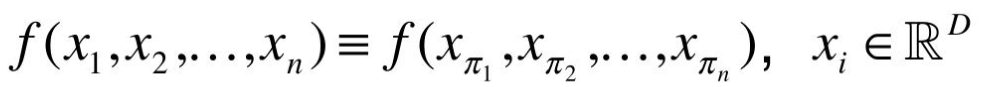

# PointNet : Deep Learning on Point Sets for 3D Classification and Segmentation论文理解

参考博客：https://blog.csdn.net/qq_43210957/article/details/118336042?spm=1001.2014.3001.5502

## 摘要

摘要部分主要告诉我们：

- **1、点云是一种很重要的数据结构；**

- **2、点云具有自己的特性—即irregular format(不规则形式)，之前的研究人员都想把它转化为立体模型，但却丢失了它的本性（natural invariances）。另外会引起很多不必要的复杂（voluminous）**

  这里的natural invariances指的是旋转的时候其本身不会发生变化，文章根据这个性质想到了使用对称函数，并得到了很好的实验效果。

  这里的voluminous可能是**维度陷阱**问题，这个转化为三维的过程中结构变得更加复杂，所以我们的模型在处理这些输入的过程中，就需要更多地参数，也就引发更多地参数调整，也就需要更多的数据集，这是我们不想看到的。

- **3、文章提出了一种从点云开始一步到位的模型**

  之前的模型：需要额外进行结构的提取；

  新提出的模型：只需要从点云开始就可以获取最终结果；

- **4、同时对模型学习的内容做了一定的解释，并处理了鲁棒性的问题**

  对自己设计的模型进行解释，并证明是在朝着最近深度学习潮流发展；

  主要学习对于通用的鲁棒性问题的处理方法。

## 引言

**首先**，作者调研了传统处理方法，发现大部分研究人员通常会将这些数据转换为常规的3D体素网格或者图像集合，再将它们输入到深层网络架构中，因为**卷积网络要求高度规则的输入数据格式**，而点云或网格不是常规的格式，并不具有相似的结构，所以不能使用。

**之后**，提出PointNet，这个网络模型具有：

- **1、简单易学的特点**

  不需要对它进行技术性的转化，只是将点云作为输入与输出；

- **2、要考虑到点云的特点**

  - 点云只是一个set，它具有排列的不变性，所以在计算的时候要做出一定的权衡；
  - 考虑刚体运动的进一步不变性；

- **3、PointNet可以解决三种常见问题**

  - 整张图片一个大标签
  - 图片中每个像素有一个标签
  - 图片每一部分信息有一个标签

- **4、PointNet结构简单**

  一开始的操作都是针对系统中的每个点坐标单独运算的，不牵涉其他点坐标；

- **5、基础输入只需要(x, y, z)三个输入，更多维度的信息都是网络自动补充的**

  和卷积增加channel的方式类似；

- **6、PointNet的前几层可以提取出一些特殊的点**

  这些点富含信息，并且可以依据提取出他的原因对其进行编码。并且试验表明这些点往往恰好集中在物体的边界上面，同样的这也可以在理论上解释为什么网络有较好的抗干扰能力

- **7、最后使用一个全连接层（fully connected layers）来输出结果**

- **8、由于输入格式支持刚性变换和仿射变换，所以我们可以做一些预处理**

  添加一个数据相关的空间变压器网络，在PointNet处理数据之前尝试对数据进行规范化，从而进一步改善结果

- **9、论文作者说试验证明了这个PointNet是可以拟合任何连续的set函数**

  大约是离散数据我们都可以考虑往这个方向上考虑…

- **10、这个网络比其他的网络训练的速度快、精确度要好**

  可能是结构简单、参数少所以速度快；

**NOTE：**这里插播一条关于刚体运动及三维空间变换的知识

- **刚体**：指运动中和受力后，**形状和大小不变**，而且**内部各点的相对位置不变**的物体。不存在绝对的刚体，但可以将相机近似看做是一个刚体。
- **刚体运动（Rigid Body Motion）**：由一个旋转加上一个平移组成，两个坐标系之间的运动。可以用**欧式变换**来描述这种运动。
- **三维空间变换**：刚体变换、仿射变换、线性变换、旋转变换
  - 刚体变换：指在三维空间中，把一个物体做旋转、平移，是保持物体大小和形状不变的仿射变换。又称欧式变换、齐次变换；
  - 仿射变换：指物体从一个向量空间进行一次线性变换并接上一个平移，变换到另一个向量空间。仿射变换包括平移、旋转、缩放、剪切、反射以及它们人依次序的组合；
  - 线性变换：旋转、推移都属于线性变换。线性变换有两个性质——变换前是直线的，变换后依旧是直线，且保持比例不变；变换前是原点的，变换后依然是原点；
  - 旋转变换：包括向量旋转和坐标系旋转。向量旋转是指物体固定坐标系下的旋转，旋转后坐标发生改变；坐标系旋转指旋转后物体坐标不变；

## PointNet网络

网络结构如图：

- **第一部分（input transform）**    为了旋转原来的图片，将这个图片转正过来（向着正确的方向靠拢，不一定一步到位）

**NOTE：**

**1、**这里有一个旋转无关性的概念——也就是给予点云一个旋转，所有x, y, z坐标都变了，但是还是代表着同一个物体；

**2、**论文中给的方法是引入一个T-Net网络去学习点云的旋转，将物体校准，剩下来的PointNet只需要对校准后的物体分类或者分割就可以了；

**3、**点云旋转很简单，只需要对一个NxD的点云矩阵乘一个DxD的旋转矩阵即可；

- **第二部分（mlp(64, 64)）**    使用线性全连接层扩大特征，防止之后maxpooling的时候损失太多；

**NOTE：**由于点云是无序集，不管这些点加入集合的顺序如何，最后他们组成的图形还是那么个图形，他们的顺序完全是没必要的，所以要使用对称的函数——不管怎么调换函数变量的输入顺序，函数的计算结果也不会发生改变。如下图：

比如，max函数就满足这个特点，但是用max提取点云特征的话损失也太大了，所以不能用。

可以用一个全连接层扩大维度，这样结果的特征损失就不那么大了，PointNet用的是多个全连接层并排放在一起（如第二部分），以达到扩大特征的目的；

- **第三部分（feature transform）**    对新得到的高纬度的信息再进行一次校正，再尝试将其转正；
- **第四部分（mlp(64, 128, 1024)）**    对每个点坐标再进行一次扩展，让每个点的维度更高（依旧是使用线性全连接层）
- **第五部分（global feature）**    直接得到一个全局的特征集合，然后再接上一个网络，让输出顺利完成。（后面的网络设计根据具体目标决定——目标识别、目标检测、语义分割）

**NOTE：**

**1、**黄色框框的图 其中nx1088 一部分来自第三部分的输出，一部分来自第四部分的输出，其实就是构成一个小的跳链接然后在使用线性全连接，逐渐得到需要的点的特征。

**2、**文章前面说learns both golbal and local point features，说该网络可以解决局部信息和全局信息这个大问题，一般来说浅层网络处理局部信息好一些，深层网络处理全局信息好一些，这里使用的跳链接正是要解决这个问题。

