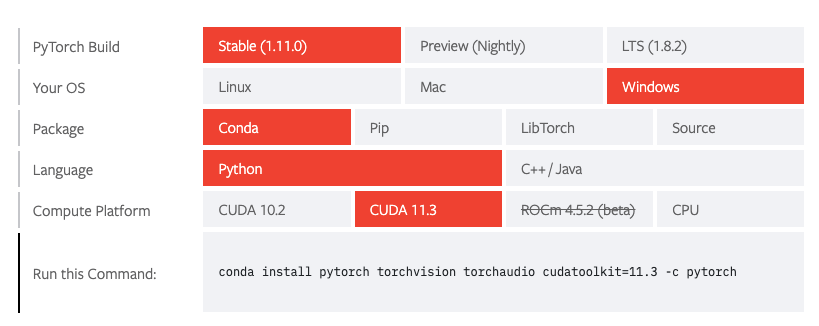

# 深入浅出PyTorch

## PyTorch简介

PyTorch是由Facebook人工智能研究小组开发的一种基于Lua编写的Torch库的Python实现的深度学习库。


## PyTorch安装

### Step 1  查看显卡型号

查看CUDA版本信息：

Windows使用`cmd`输入`nvidia-smi`

Linux使用`terminal`输入`nvidia-smi`


### Step 2  安装匹配型号的PyTorch

#### 登录[PyTorch官网](https://pytorch.org/)

#### Install


这一步可以选择本地开始（Start Locally），云开发（Cloud Partners)，以前的Pytorch版本（Previous PyTorch Versions），移动端开发（Mobile），在此处我们需要进行本地安装；

#### 选择命令



**注：**

**1、**Stable代表稳定版本；Preview代表先行版本

**2、**查看适配版本可以到：[Previous Pytorch Versions](https://pytorch.org/get-started/previous-versions/)

#### 下载后检验是否成功

使用安装了PyTorch的虚拟环境，输入包含以下代码的python文件

```python
import torch
torch.cuda.is_available()
```

如果可以调用cuda，则返回True，安装的CPU版本的话会返回False


## PyTorch相关资源

[Awesome-pytorch-list](https://github.com/bharathgs/Awesome-pytorch-list)：目前已获12K Star，包含了NLP,CV,常见库，论文实现以及Pytorch的其他项目。

[PyTorch官方文档](https://pytorch.org/docs/stable/index.html)：官方发布的文档，十分丰富。

[PyTorch-handbook](https://github.com/zergtant/pytorch-handbook)：PyTorch手中书。

[PyTorch官方社区](https://discuss.pytorch.org/)：PyTorch交流区。


## PyTorch基础知识

### 1. 张量

这一部分内容先简介一下张量，建立起对数据的描述，再介绍张量运算，最后讲PyTorch中所有的神经网络核心包`autograd`（自动微分）

#### 1.1 简介


#### 1.2 创建tensor

#### 1.3 张量的操作

#### 1.4 广播机制

### 2. 自动求导

### 3. 并行计算
