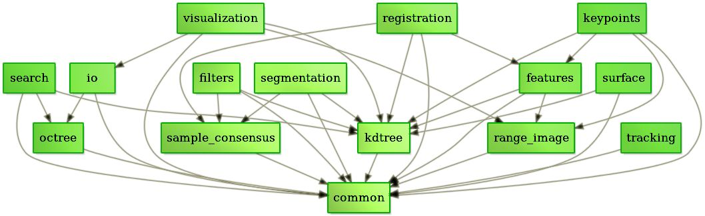

# 环境配置

参考博客：https://blog.csdn.net/qq_33561192/article/details/112706153?spm=1001.2014.3001.5502

## PCL安装与配置

- PCL-1.12.1-AllInOne-msvc2019-win64.exe  [下载地址](https://github.com/PointCloudLibrary/pcl/releases)
- pcl-1.12.1-pdb-msvc2019-win64.zip（用于复制到安装的bin目录）[下载地址](https://github.com/PointCloudLibrary/pcl/releases)

NOTE：文件名中的msvc2019意思是改PCL仅适配VS2019，其他版本跑不了

下载好后先安装all in one，傻瓜式安装，一直点下一步就好了。


Note：这里可以选择直接配置PATH到当前用户，但是会出问题（不建议），我选择的是先不设置PATH等后期自己手动添加环境变量，具体步骤参考教程；

## Visual Studio2019配置

PCL下好以后，下载Visual Studio2019，安装好后需要重启。


VS2019安装好后开始配置项目属性设置

1、点开项目属性，在调试下对环境进行配置，设置内容如下

```c++
PATH=$(PCL_ROOT)\bin;$(PCL_ROOT)\3rdParty\FLANN\bin;$(PCL_ROOT)\3rdParty\OpenNI2\Tools\bin;$(PCL_ROOT)\3rdParty\Qhull\bin;$(PCL_ROOT)\3rdParty\VTK\bin
```

2、在C/C++ > 常规下，将 SDL检查器 改为 **No**


3、在VC++ 目录下，对包含目录进行设置


更改内容如下：


4、更改同目录下的库目录


更改内容如下


5、在C/C++下的预处理器下，设置预处理器定义


具体内容如下：

6、链接器的输入中，对Debug和Release分别配置不同的文件，具体配置参考教程。

**NOTE1**：【深坑】由于版本不同，配置的文件也不一样，注意需要找到自己PCL对应的版本（不是PCL版本而是所使用的的vtk等的版本），然后一个个更改文件名。

## 配置过程中的疑问

1、Debug和Release是什么？

- Debug是**调试版本**，包含调试信息，并且不做任何优化，便于调试程序。Debug模式下会生成两个文件，除了.exe（executable file）可执行文件和.dll（Dynamic Link Library）动态链接库文件，还会生成一个.pdb文件，该文件记录了代码汇总断点等调试信息。
- Release是**发布版本**，与Debug不同，Release不对源代码进行调试，编译时对应用程序的速度进行优化，让程序在代码大小和运行速度上都是最优的。Release模式下只会生成一个文件（.exe或者.dll）

2、Debug和Release的区别是什么？

Debug包含调试信息，容量会比Release大很多，**速度会比Release慢非常多**；Release会生成的更快一些，而且**进行了各种优化**。选择他们的哪一个还是要根据具体情况分析，各有优势。


# 第一节 绪论


- 点云数据及获取
- 点云处理基本算法
- 常用的软件、开源库和数据集
- 思考题

## 点云数据及获取

### 定义

— **点云**（PointCloud）：三维点的数据集合

### 属性

— 三维坐标

— 强度：不同物体激光获取点时反射的强度是不一样的，强度信息可用于分类中；

— 颜色：摄像机和激光雷达配准到一起，可以将三维点和图像匹配，得到颜色信息；如果用的是深度相机，计算外参，将颜色信息复制到点云上；

— 时间戳

### 分类

— 点云组织形式：

- organized：the point cloud is laid out as a 2D array of points that resembles an image like structure.
- unorganized：the point cloud is a list of points.

### 点云获取方式

— **激光扫描仪**（Laser Scanner / LiDAR Light Detection And Ranging）：工作原理：time-of-flight


Range = travel time × speed of light / 2

Record ( azimuth, zenith, range, intensity )

根据平台不同，可分为：

- **星载**：卫星携带激光雷达获取信息，常见系统有GLAS星载激光雷达系统、CALIOP星光激光雷达、ALADIN星载多普勒激光雷达等；主要用于探测大气气溶胶、云地表反射率、地表高度、二氧化碳、冰川、大气水汽等；
- **机载**：使用配有GPS/IMU的飞机（无人机）获取大范围点云；特点具有精度高（10cm）、大尺度测绘；应用于大尺度（城市级别）测绘、DEM、正射影像（高精度相机）等。（飞行距离高，检测的大多是屋顶，相较于地面，机载在处理数据时需要算法上的优化。）
- **地面**：激光雷达固定在三脚架上，进行较大范围扫描获取点云；特点有精度高（可达到mm）、距离远（可达到400m）、扫描速度快（Leica RTC360 1s采集~200万点云）；常应用于文物三维扫描建模、地形测量等。
- **移动**：激光雷达跟着移动物体（机器人、无人车）进行较大范围扫描获取点云；特点有精度高（cm）、距离远（~240m）、扫描速度快（10Hz、200万点云/秒）；应用于无人车、机器人、街景测量等；

— **深度相机**（depth camera）：成像原理通过近红外激光器把具有结构特征的光线投影到物体上，通过红外摄像头采集得到深度信息；特点有成本低，计算量小、主动光源，夜晚也可以用、观测范围和距离有限、不适用于室外，阳光会影响近红外光；观测10m以上不确定性高；应用于室内机器人或者AR/VR。

— **双目相机**（Stereo Camera）：像人眼一样，使用两个相机从不同位置获取物体的两幅图像，通过计算对应点的位置偏差，使用三角原理（Triangulation）计算点的三维坐标；特点有成本低、室内室外都适用、对环境光敏感、基线限制了测量范围；

— **光学相机多视角重建**：SFM运动结构恢复（Structure from motion）给出多幅图像及其图形特征点的对应集合，估计3D点的位置和摄像机姿态（运动）；特点有成本低、使用高精度相机和更稳定的平台（有GPS/IMU）可以进行高精度测量、计算量大。


## 点云数据处理

### 点云滤波（filtering）

#### 概念

用于检测和移除点云中的噪声或不感兴趣的点；

#### 分类

- 基于统计信息（statiscal-based）
- 基于领域（neighbor-based）
- 基于投影（projection-based）
- 基于信号处理（singal processing based）
- 基于偏微分方程（PDEs-based）
- 其他方法：voxel grid filtering, quadtree-based, etc.

二维有像素、三维有体素

#### 常用方法

- 基于体素（voxel grid）
- 移动平均最小二乘（Moving Least Squares）：用于提取地面点


### 点云关键点（keypoints）

#### 特点

- keypoints是图像或点云中稳定的、独特的、可以用明确的检测标准来识别的点；
- 与原始点云相比，数量较少；
- 与特征描述符相结合，用于物体检测（object detection）、分类（classification）、配准（registration）等；

#### 常用方法

- Designed for 3D point cloud and range maps（专为三维点云和测距图设计）
  - Intrinsic Shape Signatures（ISS）
  - NARF
  - 移动平均最小二乘（Moving Least Squares）
- Derived from 2D interest point（源于二维特征点）
  - Harris
  - SIFT
- Deep learning based method（基于深度学习的方法）


### 点云分割（segmentation）

#### 定义

根据空间、集合等特征将点划分为不同的集合

#### 常用方法

- 基于边缘的方法：变成图像，使用边缘信息
- 基于区域生长：从某个点开始，找点云的法向量附近的平行的点； 
- 几何模型拟合：拟合平面、球形、圆柱等；

基于区域生长的实际例子

Segmention using smoothness constraints


normal：法向量

residual：算法向量的时候，想象平面有质量，如果点都在平面上，那么residual就相对小一些，如果所有点都在一个球上，那么residual就很大；

### 点云匹配（point cloud registration）

估计两帧或者多帧点云之间的rigid body transformation信息，将所有帧的点云配准在同一个坐标系；

#### 分类

- 初匹配/粗匹配：适用于初始位姿差别大的两帧点云
- 精匹配：优化两帧点云之间的变换
- 全局匹配：通常指优化序列点云匹配的误差，如激光SLAM，两帧之间的匹配，全局匹配；

#### 常用方法

- 基于**Iterative Closest Point（ICP）**方法
- 基于特征的匹配方法
- 深度学习匹配方法

### 点云目标检测（object detection）

从点云中检测某类物体

#### 方法

- 传统机器学习方法
- 深度学习方法

Review推荐：3D Object Detectation and Classification (Fernandes et al. 2021)

### 点云分类（classification）/语义分割（Sementic Segmentation）

为每个点云分配一个语义标签

#### 方法

- 传统机器学习方法
- 深度学习方法

相关论文：1、Landrieu, L., & Simonovsky, M.(2018)   2、Credit to : Ladarge, F., & Mallet, C. (2012)

### 点云数据处理—模型重建

#### 模型重建（model reconstruction）

从点云中获取更精简更紧凑的模型，如获取mesh模型；

常见的3D shape representation：深度图，点云，体素，网格（mesh）—渲染的时候要展示的时候一般用网格

#### 常用方法

- Delaunay Mesh Generation
- Finite Element Mesh Generation
- Marching cubes

相关论文：1、Wang et al. 2018; 2、Credit Matthew Fisher


## 常用软件及开源库

### 软件

#### CloudCompare

- 点云处理软件
- 开源，支持多平台
- 支持常见点云数据格式，简单的点云编辑
- 支持用户自己添加插件和增加新功能（如Ransac，Poisson Mesh Reconstruction，Classification with CANUPO）
- 适用于点云可视化、简单编辑或处理

#### 商软推荐


#### Meshlab

- 处理和编辑3D三角形网格的开源系统
- 主要是编辑、清理、修复、检查、渲染、纹理和转换网格工具
- 3D Acquisition: color mapping and texturing
- Cleaning 3D models
- 支持多平台（win、Linux、Mac）

### 开源库

#### PCL

- Filter
- Segmentation
- Registration
- Keypoints
- Recognition

特点：

- 支持多平台（win、Linux、Mac）
- 功能齐全、可扩展性好
- 广泛用于机器人，很多开源算法和系统（ROS）

#### Open3D

- surface alignment
- 3D machine learning support with PyTorch and Tensorflow
- GPU acceleration for core 3D operation

特点:

- 支持多平台
- Python集成成熟，可和PyTorch、TensorFlow集成；

### 数据集

#### ETH dataset

- Purpose：point cloud registration
- Scenarios: indoor, outdoor
- Sensors: IMU, GPS, Hukuyo, Leica TS15

#### Semantic 3d

- Purpose: registration, sementic segmentation
- Scenarios: urban and rural scenes
- Sensors: terrestrial lidar

#### Stanford 2D-3D-Sementics Dataset(2D-3D-S)

- Purpose：indoor scene understanding
- Scenarios: indoor offices
- Sensors: structured-light sensors

#### KITTI/KITTI-360

- Purpose: lidar SLAM, object detection
- Scenes:urban roads
- Sensors: IMU, GPS, velodyne

## 思考题

- 如果需要获取某个校园的三维模型，请问有哪些传感器的选择？
- 如果设置室内导游机器人，点云获取的传感器有那些选择？
- 建设在室内使用深度相机检测和跟踪行人，需要使用哪些点云处理模块？


# 第二节 PCL基础

目录

- PCL介绍与配置
  - 编程必备的一些基本概念
  - PCL设计理念与基本架构
  - 如何安装配置PCL以及使用
- PCL库编译（Win+Linux）
- PCL中的类的介绍
- 自定义PCL的点类型
- 在项目中使用PCL库
- 实践：手把手写一个并调试PCL小程序


## 点云库介绍

###  PCL设计理念与基本架构


必须库：Boost、Eigen、FLANN、VTK、Qhull

做输出的库：OpenNI

加速用到的库：OpenMP

### 为什么学PCL

1、PCL包括常见的点云算法，而且不断更新，开箱即用；

2、PCL商用免费，企业开发使用；

3、ROS等很多领域上有很多算法也是基于PCL开发的；

4、C++编写，效率高，支持openmp与TBB并行，支持SIMD；

5、学术界和工业界针对点云最全的库，资料很多；

### 如何学PCL

官网：https://pointclouds.org/

Github： https://github.com/PointCloudLibrary/pcl

教程：https://pcl.readthedocs.io/en/latest/

文档：https://pointclouds.org/documentation/

参考博客：https://zhuanlan.zhihu.com/p/268524083

#### 第一步—看官网DEMO学习

官网对每个模块有介绍、示例代码；结合博客，找到需要的功能；

#### 第二步—实践环节调代码

具体的代码路径：`F:\Program Files\PCL 1.12.1\share\doc\pcl-1.12\tutorials\html\index.html`（但是教程很过时了）

函数库路径：`F:\Program Files\PCL 1.12.1\share\doc\pcl-1.12\html\pcl-1.12.chm`

#### 第三步—看官网各模块函数的解释

对应每个模块的对象函数详解，对照代码来看就行；

### PCL代码框架



将PCL分为一系列较小的代码库，可以分别进行编译。

- filters：实现采样、去除离群点、特征提取、拟合估计等过滤器；
- features：实现多种三维特征的筛选，如：曲面法线、曲率、边界点估计等；
- I/O：该IO库包含用于从各种传感器装置的读取和写入点云数据（PCD）文件，以及采集的点云的类和函数，实现数据的输入和输出操作；通过OPENNI来获取
- surface：实现表面重建技术，如网格重建、凸包重建；
- registeration：实现点云配准方法，如ICP等；PCL只有两帧的配准，没有整体的配准，这里Open3D可以；
- keypoints：实现不同的关键点提取方法；
- range image：实现支持不同点云数据集生成的深度图像；
- Kd-tree：快速索引的数据结构，采取FLANN；
- Octree：八叉树，快速索引的数据结构；（索引的功能：快速找到临近点）
- Segmentation：点云分割提取算法；
- sample consensus：采样，例如RANSAC，线，平面，圆柱体，球体；
- Visualization：可视化，利用VTK库实现可视化；

**NOTE**：会用到C++中的类的继承关系，学一下补笔记；

### 怎么用PCL

在Windows上：

下载PCL-1.12.1-AllInOne-msvc2019-win64.exe—只能在VS2019上使用；其他都不可以用；

在Linux上：

安装PCL的命令：`sudo apt install libpcl-dev`

或者

直接安装ROS；

下载版本的对应关系如下所示：


### 编程必备的基础概念

- PCL是大型跨平台开源C++编程库；
- 计算机**64位**、32位；exe、pcl、opencv都需要64位；
- 编译的debug、release也要对应，debug是调试，release是发布，用release库计算会更快；
- 动态库(.h)、静态库(.lib)——查一下这个概念；
- VS的版本问题；
- C++的模板编程与基本用法；——用到的很多，恶补一下模板类，例子如下：

```c++
template <class Elem> class Array{
  Elem* data;
  int size;
public:
  Array(int sz);
  int GetSize();
  Elem& operator[](int idx);
}
```

- cmake的原理与简单使用方法；

### 使用PCL两种途径

#### Windows

直接配置VS环境：https://mp.weixin.qq.com/s/aMqZcjJM_bCKgqJPCXJeMg

使用cmake配置环境

##### CMake简介

- 跨平台的安装（编译）工具，可以用简单的语句来描述所有平台的安装（编译过程）；
- 能够输出各种各样的makefile或者project文件，能测试编译器所支持的C++特性，类似UNIX下的automake，只是CMake的组态档取名为CMakeLists.txt。
- 不直接构建最终的软件，而是产生标准的建构档（如Unix的Makefile或Windows Visual C++的projects/workspaces），然后再以一般的建构方式使用。
- 这使得熟悉某个集成开发环境（IDE）的开发者可以用标准的方式建构他的软件，这种可以使用各平台的原生建构系统的能力是CMake与SCons等其他类似系统的区别之处。

| 名称     | 文件格式                      |
| -------- | ----------------------------- |
| 源码/库  | .h .hpp .cpp .so .a .dll .lib |
| 构建工具 | cmake/qmake/autotools/bazel   |
| 生成器   | makefile/ninja/msbuild        |
| 编译器   | gcc/clang/mingw/vs            |
| 编译产物 | .exe .so .a .dll .lib         |

**NOTE**：在具体应用后来看，CMake起到的是一个生成VS Project的作用，生成后在项目中加入想要用到的东西。

### PCL处理流程

- 创建处理对象（例如过滤、特征估计、分割等）；
- 使用setInputCloud通过输入点云数据，处理模块；
- 设置算法相关参数；
- 调用计算（或过滤、分割等）得到输出；

例子：

```c++
pcl::search::Search<pcl::PointXYZ>::Ptr tree = boost::shared_ptr<pcl::search::Search<pcl::PointXYZ> > (new pcl::search::KdTree<pcl::PointXYZ>);   //创建一个指向Kd树搜索对象的共享指针

pcl::PointCloud <pcl::Normal>::Ptr normals (new pcl::PointCloud <pcl::Normal>);

pcl::NormalEstimation<pcl::PointXYZ, pcl::Normal> normal_estimator;  //创建法线估计对象

normal_estimator.setSearchMethod(tree);  //设置搜索方法

normal_estimator.setInputCloud(cloud);  //设置法线估计对象输入

normal_estimator.setKSearch(KN_normal);  //设置用于法向量估计的K近邻数目

normal_estimator.compute(*normals);  //计算并输出法向量
```

### 实践—用CMake生成工程

#### 1- 画一个球、显示一个pcd文件中的数据

#### 2- 区域生长分割Region_growing_segmentation

具体内容：https://pcl.readthedocs.io/projects/tutorials/en/latest/region_growing_segmentation.html

#### 3- ICP代码实现

ICP（一个自动配准的方法）代码实现：https://blog.csdn.net/qq_29462849/article/details/85080518

还发现了一个好App——CloudCompare，把pcd文件放进去，就可以看到它的具体形态。

## 如何编译PCL（win）

正常情况下 直接使用PCL库即可（是直接编译好的PCL）

WIN：PS> .\vcpkg install pcl

Linux：$ sudo apt install libpcl-dev

### 什么情况下要编译PCL？

1、官方版本与项目需求不一致（如要求对应VS2019版本但是现在只能用VS2017）

2、需要对原PCL算法进行改进

3、需要更多的拓展模块（例如qvtk）


### PCL第三方依赖库

| 第三方库 | 用途                                                         | 是否必选 |
| -------- | ------------------------------------------------------------ | -------- |
| Boost    | 用于智能指针等操作                                           | 必选     |
| Eigen    | 用于矩阵运算等                                               | 必选     |
| FLANN    | 用于邻域搜索等                                               | 必选     |
| VTK      | 可视化库，可用于显示点云                                     | 必选     |
| Qt       | 用于图像交互界面等                                           | 必选     |
| QHULL    | 一个强大的计算几何库，可以用于计算高维convex hull, Delaunay triangulation, Voronoi diagram等 | 必选     |
| OpenNI   | 用于获取点云等                                               | 可选     |

**NOTE**：编译时要确认安装正确的第三方库，不能混合32位和64位代码，而且不能混用不同编译器编译第三方库

### Boost编译

#### Boost简介

Boost库是一个可移植、提供源代码的C++库，作为标准库的后备，是C++标准化进程的开发引擎之一。 Boost

库由C++标准委员会库工作组成员发起，其中有些内容有望成为下一代C++标准库内容。在C++社区中影响甚大

，是不折不扣的“准”标准库。Boost由于其对跨平台的强调，对标准C++的强调，与编写平台无关。大部分boost

库功能的使用只需包括相应头文件即可，少数（如正则表达式库，文件系统库等）需要链接库。但Boost中也有

很多是实验性质的东西，在实际的开发中实用需要谨慎。

#### 编译流程

第一步  进入boost文件夹，运行boostrap.bat，运行结束后生成project-config.jam

第二步  使用命令编译boost

```c++
b2.exe install toolset=msvc-14.1 address-model=64 --without-python --build-dir=build\vc14_x64 --prefix="C:\pcl\Boost"
```

（这里使用的是PCL1.11.1 对应的boost是1.74.0，以上命令仅作参考，后期根据需要更改版本号和路径即可）

### Eigen编译

#### Eigen简介

Eigen是一个高层次的C ++库，有效支持线性代数，矩阵和矢量运算，数值分析及其相关的算法。

#### 编译流程

使用CMake，分别设置eigen的source和build路径

注意Configure时有CMAKE_INSTALL_PREFIX这个选项，默认为C:\Program Files\Eigen

### FLANN编译

#### FLANN简介

FLANN（Fast Library for Approximate Nearest Neighbors），目前最完整的（近似）最近邻开源库。不但实现了一系列查找算法，还包含了一种自动选取最快算法的机制。

#### 编译流程

```c++
BUILD_C_BINDINGS(check)
BUILD_MATLAB_BINDINGS(uncheck)
BUILD_PYTHON_BINDINGS(uncheck)
CMAKE_CONFIGURATION_TYPES Debug;Release
CMAKE_INSTALL_PREFIX C:\pcl\flann
```

添加一个entry：

Name：CMAKE_DEBUG_POSTFIX

Type：STRING

Value：-gd

### Qhull编译

#### Qhull简介

Qhull计算凸包，Delaunay三角剖分，Voronoi图，关于点的半空间交点，最远位置Delaunay三角剖分和最远位

置Voronoi图。 源代码以2维，3维，4维和更高维度运行。 Qhull实现了用于计算凸包的Quickhull算法。 它处理

浮点运算的舍入误差。 它计算凸体的体积，表面积和近似值。

#### 编译流程

CMAKE_INSTALL_PREFIX C:\pcl\qhull

添加一个entry：

Name：CMAKE_DEBUG_POSTFIX

Type：STRING

Value：-d

### VTK编译

#### VTK简介

VTK（visualization toolkit）是一个开源的免费软件系统，主要用于三维计算机图形学、图像处理和科学计算可

视化。VTK是在三维函数库OpenGL 的基础上采用面向对象的设计方法发展起来的，它将我们在可视化开发过

程中会经常遇到的细节屏蔽起来，并将一些常用的算法封装起来。

#### 编译流程

BUILD_SHARED_LABS(uncheck)

CMAKE_CXX_MP_FLAG(check)

VTK_RENDERING_BACKEND  选择OpenGL2

添加一个entry：

Name： CMAKE_DEBUG_POSTFIX 

Type: STRING 

Value: -d 

## PCL头文件的作用（总结）

```C++
<pcl/io/pcd_io.h>pcd									  读写类
<pcl::point_types.h>									  点类
<liblas/liblas.hpp>										  支持las文件格式读写
<pcl/kdtree/kdtree_flann.h>						  k-d树 
<pcl/octree/octree.h> 									Octree
<pcl/features/normal_3d.h> 							法向量计算
<pcl/visualization/cloud_viewer.h> 			可视化类
<pcl/keypoints/sift_keypoints.h> 				SIFT
<pcl/keypoints/harris_3D.h> 						Harris
<pcl/keypoints/uniform_sampling.h> 			降采样
<pcl/filters/extract_indices.h> 				基于索引的点云提取构建
<pcl/registration/icp> 									icp的实现
<pcl/registration/ndt.h> 								ndt配准
<pcl/sample_consensus/ransac.h> 				rancsac拟合平面
<pcl/sample_consensus/sac_model_plane.h> 
<pcl/common/transforms.h> 							给点云做旋转变换
<pcl/common/distances.h> 								点到直线的距离
```


## PCL点云数据点类型介绍

point_types.hpp中有完整点云类型定义

```c++
• PointXYZ
• PointXYZI
• PointXYZRGBA
• PointXYZRGB
• PointXY
• InterestPoint
• Normal
• PointNormal
• PointXYZRGBNormal
• PointXYZINormal
• PointWithRange
• PointWithViewpoint
• MomentInvariants
• PrincipalRadiiRSD
• Boundary
• PrincipalCurvatures
• BounPFHSignature125dary
• FPFHSignature33
• VFHSignature308
• Narf36
• BorderDescription
• IntensityGradient
• Histogram
```

最常见的点类型：`PointXYZ:float x,y,z`

包含x, y, z数据，为了读取的速度，四个float满足内存对齐；

```C++
float x = pc.points[i].data[0];
float y = pc.points[i].data[1];
float z = pc.points[i].data[3];

float x = pc.points[i].x;
float y = pc.points[i].y;
float z = pc.points[i].z;
```

## 如何在项目中嵌入PCL

必须保证pcl依赖与项目保持一致

最简单的方法就是用cmake来引用，非常简单；

否则要手动添加pcl，即头文件和库与cmake的逻辑是一致的，但非常麻烦；

camke 代码如下：

```C++
project(cloud_viewer)//这里要更改对应的项目名称
add_executable(${PROJECT_NAME})
target_sources( ${PROJECT_NAME}
   PRIVATE
        cloud_viewer.cpp  //这里也要更改对应的项目名称
) 
find_package(PCL REQUIRED)
#include
target_include_directories(${PROJECT_NAME}
        PUBLIC
        ${PCL_INCLUDE_DIRS}
    )
#link
target_link_directories(${PROJECT_NAME}
    ${PCL_LIBRARIES}
    )
```

## 自定义点类型及使用

自定义点类型


使用自定义点类型


